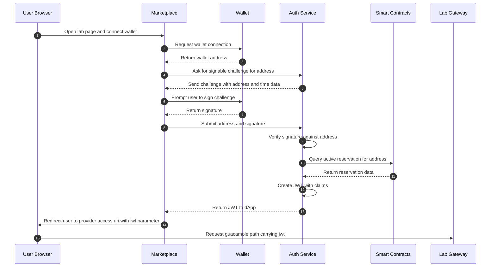

# Authentication Service

The Authentication Service provides secure authentication and authorization for the DecentraLabs ecosystem, supporting both Web3 wallet-based login and SAML2 SSO integration.

## Overview

The auth service bridges traditional institutional SSO systems with blockchain-based access control, generating JWT tokens that encode both identity and blockchain-validated reservations.

## Authentication Flows

### Wallet Challenge Flow



### SAML2 SSO Flow

The SAML2 flow supports two modes:

1. **Authentication-only** (`/auth/saml-auth`): Validates SAML assertion and issues JWT without blockchain validation
2. **Booking-aware** (`/auth/saml-auth2`): Additionally validates active blockchain reservation before issuing JWT

## Features

### Wallet Challenge Authentication
- Cryptographically secure challenge generation with timestamps
- ECDSA signature verification using Web3
- Address recovery from signed messages
- Replay attack protection via timestamp validation

### SAML2 Integration
- SAML assertion parsing and validation
- XML signature verification
- Attribute extraction (user ID, affiliation, etc.)
- Support for both IdP-initiated and SP-initiated flows

### JWT Generation
- RS256 algorithm with rotating keys
- JWKS endpoint for public key distribution
- OIDC discovery metadata
- Configurable claims and expiration

### Smart Contract Validation
- Direct on-chain reservation queries
- Lab booking verification
- Time-based access validation (nbf/exp claims)
- Support for both reservation keys and lab IDs

## API Reference

### Get Challenge Message

Get a challenge message to sign with a wallet.

```http
GET /auth/message
```

**Response:**
```json
{
  "message": "Login request: 1699545600",
  "timestamp": "1699545600"
}
```

### Wallet Authentication (Simple)

Authenticate with wallet signature, no booking validation.

```http
POST /auth/wallet-auth
Content-Type: application/json

{
  "wallet": "0x742d35Cc6634C0532925a3b844Bc454e4438f44e",
  "signature": "0x1234567890abcdef..."
}
```

**Response:**
```json
{
  "token": "eyJhbGciOiJSUzI1NiIsInR5cCI6IkpXVCJ9...",
  "wallet": "0x742d35Cc6634C0532925a3b844Bc454e4438f44e"
}
```

### Wallet Authentication + Authorization

Authenticate with wallet signature and validate active reservation.

```http
POST /auth/wallet-auth2
Content-Type: application/json

{
  "wallet": "0x742d35Cc6634C0532925a3b844Bc454e4438f44e",
  "signature": "0x1234567890abcdef...",
  "reservationKey": "0xabc123..."
}
```

Alternative with lab ID:
```json
{
  "wallet": "0x742d35Cc6634C0532925a3b844Bc454e4438f44e",
  "signature": "0x1234567890abcdef...",
  "labId": "42"
}
```

**Response:**
```json
{
  "token": "eyJhbGciOiJSUzI1NiIsInR5cCI6IkpXVCJ9...",
  "labURL": "https://provider.com/guacamole/?jwt=eyJhbG..."
}
```

### SAML2 Authentication (Simple)

Authenticate with SAML assertion, no booking validation.

```http
POST /auth/saml-auth
Content-Type: application/json

{
  "samlResponse": "PHNhbWxwOlJlc3BvbnNl..."
}
```

**Response:**
```json
{
  "token": "eyJhbGciOiJSUzI1NiIsInR5cCI6IkpXVCJ9...",
  "userid": "user@institution.edu",
  "affiliation": "staff@institution.edu"
}
```

### SAML2 Authentication + Authorization

Authenticate with SAML assertion and validate active reservation.

```http
POST /auth/saml-auth2
Content-Type: application/json

{
  "samlResponse": "PHNhbWxwOlJlc3BvbnNl...",
  "labId": "42"
}
```

**Response:**
```json
{
  "token": "eyJhbGciOiJSUzI1NiIsInR5cCI6IkpXVCJ9...",
  "labURL": "https://provider.com/guacamole/?jwt=eyJhbG..."
}
```

### JWKS Endpoint

Get public keys for JWT validation.

```http
GET /auth/jwks
```

**Response:**
```json
{
  "keys": [
    {
      "kty": "RSA",
      "use": "sig",
      "kid": "blockchain-services-key",
      "n": "0vx7agoebG...",
      "e": "AQAB"
    }
  ]
}
```

### OIDC Discovery

Get OIDC discovery metadata.

```http
GET /auth/.well-known/openid-configuration
```

**Response:**
```json
{
  "issuer": "http://localhost:8080/auth",
  "jwks_uri": "http://localhost:8080/auth/jwks",
  "response_types_supported": ["id_token"],
  "subject_types_supported": ["public"],
  "id_token_signing_alg_values_supported": ["RS256"]
}
```

## JWT Claims

### Standard Claims (Always Present)

- `iss` (Issuer): URL of the auth service
- `iat` (Issued At): Token creation timestamp
- `jti` (JWT ID): Unique token identifier (UUID)

### Authorization Claims (auth2 endpoints)

When there is an active blockchain reservation:

- `aud` (Audience): Lab access URL
- `sub` (Subject): Credential/subject for lab access
- `nbf` (Not Before): Reservation start time
- `exp` (Expiration): Reservation end time
- `labId`: Laboratory identifier (number)

### Authentication Claims (Simple auth)

For simple authentication without reservations:

- `wallet`: Authenticated wallet address (wallet-auth)
- `userid`: SAML user identifier (saml-auth)
- `affiliation`: SAML user affiliation (saml-auth)

### Example JWT Payload

**With Reservation (auth2):**
```json
{
  "iss": "https://auth.decentralabs.com",
  "iat": 1699545600,
  "jti": "b3d7f4a8-6c9e-4b21-9a5d-387bf7e6f7a2",
  "aud": "https://provider.com/guacamole",
  "sub": "lab-credential-42",
  "nbf": 1699546200,
  "exp": 1699549800,
  "labId": 42
}
```

**Without Reservation (wallet-auth):**
```json
{
  "iss": "https://auth.decentralabs.com",
  "iat": 1699545600,
  "jti": "b3d7f4a8-6c9e-4b21-9a5d-387bf7e6f7a2",
  "wallet": "0x742d35Cc6634C0532925a3b844Bc454e4438f44e"
}
```

## Configuration

### JWT Key Management

The service uses RSA keys for JWT signing and verification:

```
config/keys/
├── private_key.pem    # RS256 signing key
└── public_key.pem     # Verification key (served via JWKS)
```

Generate new keys:
```bash
# Generate private key
openssl genrsa -out private_key.pem 2048

# Extract public key
openssl rsa -in private_key.pem -pubout -out public_key.pem
```

### Environment Variables

| Variable | Description | Default |
|----------|-------------|---------|
| `PRIVATE_KEY_PATH` | Path to JWT signing key | `config/keys/private_key.pem` |
| `PUBLIC_KEY_PATH` | Path to JWT verification key | `config/keys/public_key.pem` |
| `BASE_DOMAIN` | Base URL for JWT issuer | `http://localhost` |
| `ALLOWED_ORIGINS` | CORS allowed origins | - |
| `CONTRACT_ADDRESS` | Diamond contract for reservations | - |

### Application Properties

```properties
# JWT Configuration
jwt.private.key.path=${PRIVATE_KEY_PATH:config/keys/private_key.pem}
jwt.public.key.path=${PUBLIC_KEY_PATH:config/keys/public_key.pem}
base.domain=${BASE_DOMAIN:http://localhost}

# CORS Configuration
cors.allowed.origins=${ALLOWED_ORIGINS:}

# Contract Configuration
contract.address=${CONTRACT_ADDRESS:}
```

## Security Considerations

### Signature Verification

- All wallet signatures are verified using ECDSA secp256k1
- Message format includes timestamp to prevent replay attacks
- Signature must match the claimed wallet address

### SAML Validation

- XML signatures are validated against IdP public key
- Assertions must be within validity period
- Response destination must match expected endpoint

See [SAML_SIGNATURE_VALIDATION.md](dev/SAML_SIGNATURE_VALIDATION.md) for detailed SAML security setup.

### JWT Security

- Tokens are signed with RS256 algorithm
- Private key must be kept secure and never exposed
- Public key rotation supported via JWKS endpoint
- Short expiration times recommended (tied to reservations)

### Replay Protection

- Challenge messages include timestamps
- Old challenges (>5 minutes) are rejected
- Each JWT has unique `jti` claim

## Integration Guide

### Frontend Integration (Wallet)

```javascript
// 1. Get challenge message
const challenge = await fetch('https://auth.example.com/auth/message')
  .then(r => r.json());

// 2. Sign with Web3
const signature = await window.ethereum.request({
  method: 'personal_sign',
  params: [challenge.message, walletAddress]
});

// 3. Submit for authentication
const authResponse = await fetch('https://auth.example.com/auth/wallet-auth2', {
  method: 'POST',
  headers: { 'Content-Type': 'application/json' },
  body: JSON.stringify({
    wallet: walletAddress,
    signature: signature,
    reservationKey: reservationKey
  })
});

const { token, labURL } = await authResponse.json();

// 4. Redirect to lab
window.location.href = labURL;
```

### Frontend Integration (SAML)

```javascript
// After SAML login redirect with SAMLResponse

const samlResponse = new URLSearchParams(window.location.search).get('SAMLResponse');

const authResponse = await fetch('https://auth.example.com/auth/saml-auth2', {
  method: 'POST',
  headers: { 'Content-Type': 'application/json' },
  body: JSON.stringify({
    samlResponse: samlResponse,
    labId: '42'
  })
});

const { token, labURL } = await authResponse.json();
window.location.href = labURL;
```

### Backend Validation

```java
// Validate JWT using JWKS endpoint
String jwksUrl = "https://auth.example.com/auth/jwks";
JwkProvider provider = new UrlJwkProvider(new URL(jwksUrl));
Jwk jwk = provider.get("blockchain-services-key");

Algorithm algorithm = Algorithm.RSA256((RSAPublicKey) jwk.getPublicKey(), null);
JWTVerifier verifier = JWT.require(algorithm)
    .withIssuer("https://auth.example.com")
    .build();

DecodedJWT jwt = verifier.verify(token);

// Extract claims
Long labId = jwt.getClaim("labId").asLong();
String subject = jwt.getSubject();
```

## Troubleshooting

### Common Issues

**Invalid signature error:**
- Ensure challenge message format matches exactly
- Verify wallet address matches signer
- Check that signature is in hex format with 0x prefix

**Reservation not found:**
- Verify contract address is correctly configured
- Check that reservation exists on-chain
- Ensure reservation time window is valid

**SAML validation failed:**
- Verify IdP public key is configured correctly
- Check SAML response is not expired
- Ensure XML signature is present and valid

### Debug Mode

Enable debug logging:
```properties
logging.level.decentralabs.blockchain.service.auth=DEBUG
```

## Related Documentation

- [Wallet & Treasury](WALLET_TREASURY.md)
- [SAML Configuration](dev/SAML_AUTO_DISCOVERY.md)
- [Security Guidelines](dev/SECURITY.md)
