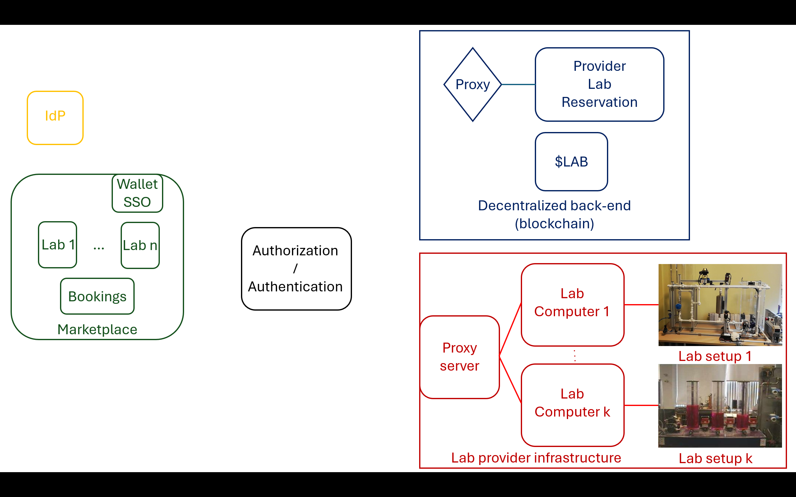
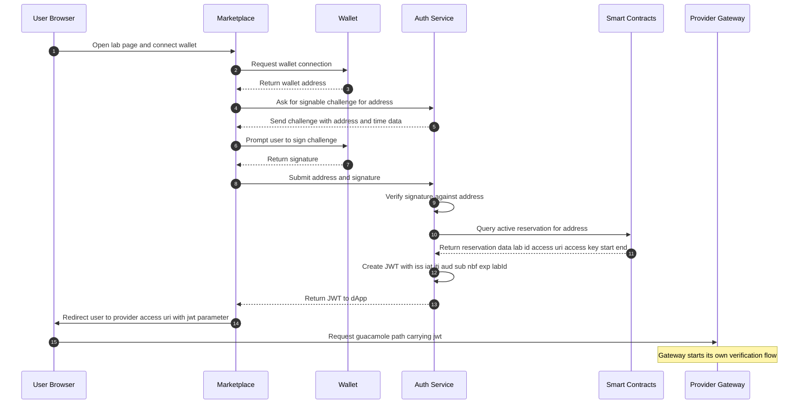

# Auth Service

<figure><figcaption></figcaption></figure>

This microservice provides web3-based JWT tokens and offers a bridge between institutional access control systems (like the **Proxy server** in the figure above) with the blockchain-based smart contracts.

It can work just as an authentication service (checking the user actually is the owner of a certain wallet address), or as an authentication + authorization service (checking against the corresponding smart contract whether the owner of the wallet has certain permissions). In the latter case, the permissions are related to whether valid bookings on remote laboratories exist or not.

This microservice is built with Java Spring Boot and prepared to be deployed in a matter of seconds as a Maven (.war) package running on Apache Tomcat (at least v. 9) with Java (at least v. 17).

It provides the following endpoints when the war package is deployed into Tomcat as auth.war:

```
- /auth/.well-known/openid-configuration: To expose endpoints for OpenID Connect.
- /auth/jwks: Offers the public key in JWKS format (OpenID Connect).
- /auth/message: Generates a message for the client to sign with their wallet.
- /auth/auth: Provides authentication by checking the signature of the message above.
- /auth/auth2: Provides authentication + authorization by additionaly consulting the corresponding smart contract.
```

There is a running example of this microservice in sarlab.dia.uned.es/auth2, but users can use this code as an inspiration to implement their own auth service or just deploy it themselves as it is for their own purposes.

The following image shows the sequence diagram that illustrates the process for authenticating and authorizing a user in the lab provider infrastructure through DecentraLabs. In this image, the **Proxy server** in the figure above is labelled as **Provider Gateway**.


