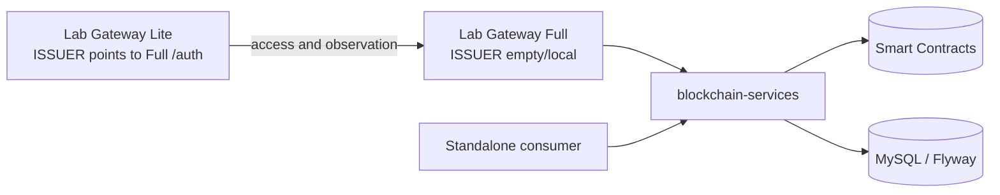

# DecentraLabs blockchain services

`Lab Gateway/blockchain-services` is the canonical Java 21 / Spring Boot backend
for the DecentraLabs gateway ecosystem. It is also publishable as a standalone
WAR for an institution that only needs consumer funding and wallet operations.

The service owns four areas:

- institutional authentication and access delivery (SAML, Marketplace JWT,
  WebAuthn, JWKS and opaque access codes);
- institutional wallet, service-credit funding and billing administration;
- signed intent intake, WebAuthn authorization and on-chain execution;
- provider/consumer registration and gateway configuration.

See the [documentation index](SUMMARY.md) and the
[architecture guide](docs/architecture/ARCHITECTURE.md) before changing a cross-service
flow.

## Operating modes

| Mode | Enablement | Intended use | Provider/auth endpoints |
| --- | --- | --- | --- |
| Provider + consumer | `FEATURES_PROVIDERS_ENABLED=true` | Full Lab Gateway backend | Enabled |
| Consumer-only | `FEATURES_PROVIDERS_ENABLED=false` (default) | Standalone institution funding its own reservations | Disabled |

`FEATURES_PROVIDERS_REGISTRATION_ENABLED` independently controls provider
registration. `FEATURES_ORGANIZATIONS_ENABLED` controls organization features.
The parent Lab Gateway selects Full versus Lite at the gateway boundary; a Lite
gateway does not become the primary identity authority merely because this
backend is present.


```mermaid
flowchart LR
    Full["Lab Gateway Full<br/>ISSUER empty/local"] --> Backend["blockchain-services"]
    Lite["Lab Gateway Lite<br/>ISSUER points to Full /auth"] -->|access and observation| Full
    Standalone["Standalone consumer"] --> Backend
    Backend --> Contracts[("Smart Contracts")]
    Backend --> DB[("MySQL / Flyway")]
```

## API map

The following is a navigation map, not a generated OpenAPI contract. Paths are
implemented by the controllers in `src/main/java/decentralabs/blockchain/controller`.

### Public identity and access (provider mode)

- `GET /.well-known/openid-configuration`
- `GET /auth/jwks`
- `POST /auth/authorize-and-issue`
- `POST /auth/access-credential`
- `POST /auth/checkin-institutional`
- `POST /auth/checkin-institutional/status`
- `POST /auth/access-code/redeem`
- `POST /auth/fmu/session-ticket/issue`
- `POST /auth/fmu/session-ticket/redeem`
- `POST /auth/fmu/provider-describe-token`
- `POST /webauthn/register` and `POST /webauthn/revoke`
- `GET /onboarding/webauthn/key-status/{stableUserId}`
- `POST /onboarding/webauthn/options`
- `POST /onboarding/webauthn/complete`
- `GET /onboarding/webauthn/status/{sessionId}`
- `GET /onboarding/webauthn/ceremony/{sessionId}`

The SAML/provider controllers are conditional on `FEATURES_PROVIDERS_ENABLED`.
FMU ticket issuance validates a booking bearer; redemption requires a
per-gateway session-observer credential.

### Intents

- `POST /intents`
- `GET /intents/{requestId}`
- `POST /intents/{requestId}/registration-mined`
- `POST /intents/authorize`
- `GET /intents/authorize/status/{sessionId}`
- `GET /intents/authorize/ceremony/{sessionId}`
- `POST /intents/authorize/complete`
- `POST /intents/authorize/client-error`

When `INTENTS_AUTH_ENABLED=true` (default), submit operations require the
configured submit scope and reads require the configured status scope. The
browser ceremony and completion are intentionally session-bound; see the
[intent guide](docs/services/intents/INTENTS_PROVISIONING.md).

### Wallet, billing and provisioning

- Wallet: `POST /wallet/create`, `POST /wallet/import`, `POST /wallet/reveal`,
  `GET /wallet/{address}/balance`, `GET /wallet/{address}/transactions`,
  `GET /wallet/listen-events`, `GET /wallet/networks`,
  `POST /wallet/switch-network`.
- Billing administration: `/billing/admin/**`, funding orders and provider
  receivables. Read-only and mutating routes are listed in the
  [wallet/billing guide](docs/services/wallet/WALLET_BILLING.md).
- Provisioning: `GET /institution-config/status` plus the challenge/approval
  flow under `POST /institution-config/*`.
- Compliance exports: `/billing/compliance/**`.
- Lab administration: `/lab-admin/**` and `/lab-content/**`.

These surfaces are network-restricted by `LocalhostOnlyFilter`; billing admin
also requires a valid internal/access token according to deployment mode.

### Health and metrics

- `GET /health` — detailed application status, including durable queue health.
- `GET /actuator/health/liveness`
- `GET /actuator/health/readiness`
- `GET /actuator/prometheus`
- `GET /actuator/metrics`
- `GET /actuator/info`

Use readiness for an orchestrator. A `DEGRADED` detailed health response is not
equivalent to a process that is unavailable; inspect `queue_health_errors` and
the individual component statuses.

`GET /health` is the detailed application status page. It reports the operating
mode, key and registration checks, nonce/outbox backlog counters and queue
errors. A database or migration query failure is represented by a `null` count
and an error code; it must not be mistaken for an empty queue.

## Reservation notifications

Email/ICS notifications are optional and disabled by the `noop` driver unless
enabled through `NOTIFICATIONS_MAIL_ENABLED`. Configure the SMTP or Microsoft
Graph driver with the `NOTIFICATIONS_MAIL_*` variables and use
`GET|POST /billing/admin/notifications` to inspect or update runtime settings.
The notification service includes the lab, reservation window, renter, payer
and transaction reference when those values are available.

## Local development

Prerequisites: Java 21 and a POSIX shell or PowerShell. MySQL is required for
durable tickets, outboxes, WebAuthn and audit flows; the unit-test suite uses
its configured test infrastructure.

```bash
./mvnw test
./mvnw -DskipTests package
java -jar target/blockchain-services-1.0-SNAPSHOT.war
```

For a local consumer-only process, leave the provider flags at their defaults
and open `http://localhost:8080/wallet-dashboard/`. For a Full gateway, enable
the provider flags and use the parent repository's Docker Compose topology.

## Docker and configuration

The local compose file in this repository is useful for a standalone backend:

```bash
cp .env.example .env
docker compose up -d
```

For the integrated gateway, use the parent `Lab Gateway/docker-compose.yml` and
its root `.env`; do not run two copies of the backend against the same port or
database. Persist `/app/data`, the MySQL volume, and the mounted key material.

Important configuration groups:

- contract and RPC: `CONTRACT_ADDRESS`, `BLOCKCHAIN_NETWORK_ACTIVE`,
  `ETHEREUM_*_RPC_URL`;
- wallet: `WALLET_FILE_PATH`, `WALLET_CONFIG_KEY_FILE`,
  `INSTITUTIONAL_WALLET_*`;
- identity: `PRIVATE_KEY_PATH`, `PUBLIC_KEY_PATH`, Marketplace public-key URL,
  SAML trust and metadata settings;
- admin boundary: `ADMIN_DASHBOARD_LOCAL_ONLY`,
  `ADMIN_DASHBOARD_ALLOW_PRIVATE`, `ADMIN_ALLOWED_CIDRS`,
  `SECURITY_ALLOW_PRIVATE_NETWORKS`, `ADMIN_ACCESS_TOKEN_*`;
- durable backend: `SPRING_DATASOURCE_*` and the outbox/monitor intervals.

Configuration precedence is environment/secrets manager, then local `.env`,
then `application.properties`. The generated wallet configuration under the
persistent data directory is an additional wallet-specific source and must be
backed up together with its encryption key.

The tracked `.env.example` is the authoritative list of deployable environment
names. Never commit `.env`, private keys, wallet files or database volumes.

## Security baseline

- Keep admin, wallet, billing, lab-admin and provisioning routes behind the
  localhost/private-network policy and a strong access token.
- Use SAML whitelist mode in production even though the development default is
  `SAML_IDP_TRUST_MODE=any`.
- Keep metadata HTTP disabled and restrict trusted proxy CIDRs.
- Persist `/app/data` and MySQL before enabling durable access, ticket or wallet
  flows.
- Keep session-observer and gateway credentials per gateway; do not reuse one
  secret across Full/Lite instances.

See [Security Configuration](docs/security/SECURITY.md) and
[Authentication and access evidence](docs/services/authentication/AUTH.md) for the complete
boundary and recovery rules.

## Verification and release

Before a change is released:

```bash
./mvnw test
./mvnw -DskipTests package
```

Flyway migrations are under `src/main/resources/db/migration`. The release
workflow publishes the WAR and checksum from `target/`; keep migrations,
configuration metadata and the endpoint guides in the same change.

## Contributing

Keep changes on a feature branch, add or update tests for behavior changes, and
update the relevant document in [SUMMARY.md](SUMMARY.md). The executable
configuration and controller mappings are the source of truth; documentation
must not advertise a route or scheduler that is not present in this repository.
