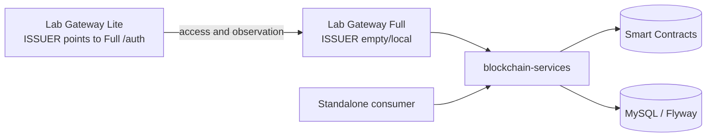
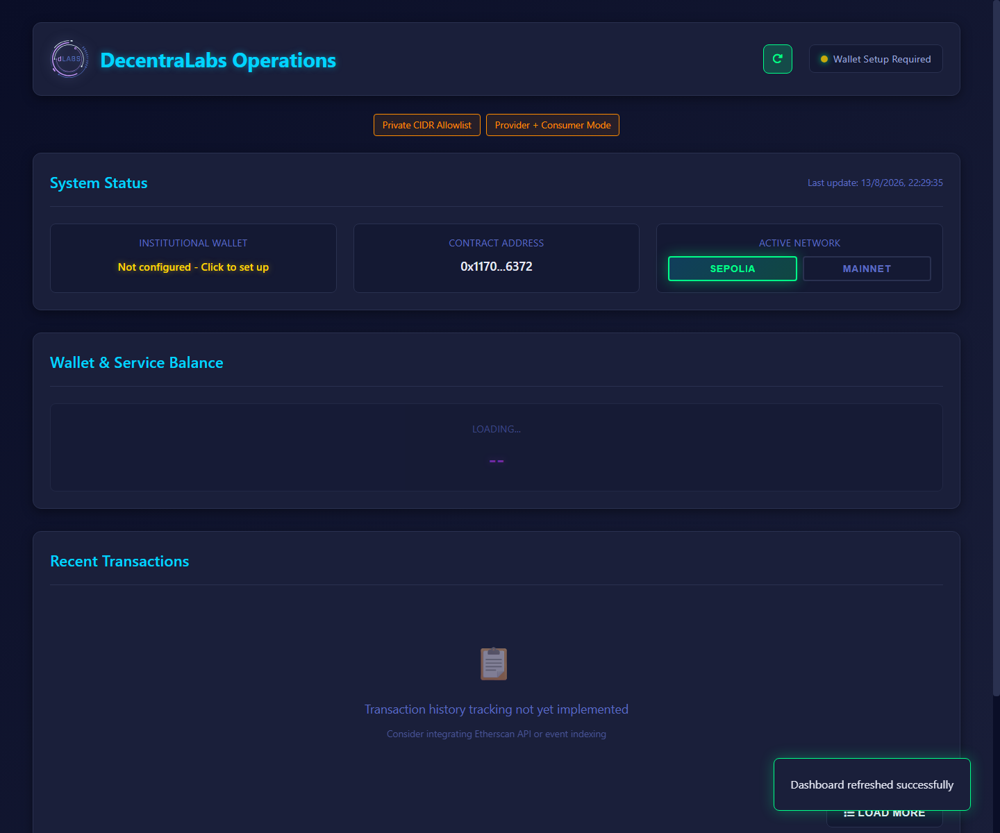

# DecentraLabs blockchain services

`Lab Gateway/blockchain-services` is the canonical Java 21 / Spring Boot 4.1
backend
for the DecentraLabs gateway ecosystem. It is also publishable as a standalone
WAR for an institution that only needs consumer funding and wallet operations.

This checkout is the parallel standalone backend variant. The embedded
`Lab Gateway/blockchain-services` submodule is the canonical backend target for
the integrated Gateway deployment; use this repository when an independent
backend checkout is explicitly required.

The service owns four areas:

- institutional authentication and access delivery (SAML, Marketplace JWT,
  WebAuthn, JWKS and opaque access codes);
- institutional wallet, service-credit funding and billing administration;
- signed intent intake, WebAuthn authorization and on-chain execution;
- provider/consumer registration and gateway configuration.

Start with the [documentation index](SUMMARY.md) and the parent
[documentation contract](../docs/documentation-contract.md). The essential companion
documents are the [architecture guide](docs/architecture/ARCHITECTURE.md),
[deployment guide](docs/configuration/DEPLOYMENT.md),
[security baseline](docs/security/SECURITY.md) and
[API reference](docs/reference/API_REFERENCE.md).

## Operating modes

| Mode | Enablement | Intended use | Provider/auth endpoints |
| --- | --- | --- | --- |
| Provider + consumer | `BLOCKCHAIN_SERVICES_MODE=provider-consumer` | Full or standalone control-plane backend | Enabled |
| Consumer-only | `BLOCKCHAIN_SERVICES_MODE=consumer-only` (packaged default) | Standalone institution funding its own reservations | Disabled |

`BLOCKCHAIN_SERVICES_MODE` is the explicit backend role and is independent of
the parent gateway topology. Set it to `provider-consumer` or `consumer-only`.
When it is left empty, the service keeps the historical
`FEATURES_PROVIDERS_ENABLED` value as a fallback. An explicit role always wins,
so changing `ISSUER` or placing the process behind a Lite gateway cannot
silently enable provider operations.

`FEATURES_PROVIDERS_REGISTRATION_ENABLED` controls provider registration within
the `provider-consumer` role; it can never elevate a `consumer-only` backend.
`FEATURES_ORGANIZATIONS_ENABLED` controls organization features.
The parent Lab Gateway selects Full versus Lite at the gateway boundary; a Lite
gateway does not become the primary identity authority merely because this
backend is present.


```mermaid
flowchart LR
    Full["Lab Gateway Full<br/>ISSUER empty/local"] --> Backend["blockchain-services"]
    Lite["Lab Gateway Lite<br/>ISSUER points to Full /auth"] -->|access and observation| Full
    Standalone["Standalone consumer"] --> Backend
    Backend --> Contracts[("Smart Contracts")]
    Backend --> DB[("MySQL / Flyway")]
```

## API map

The following is a navigation map, not a generated OpenAPI contract. Paths are
implemented by the controllers in `src/main/java/decentralabs/blockchain/controller`.

External institutional reservation requests use a five-minute pending TTL and
require a ten-minute lead before the requested start. The provider listener
retains 12-confirmation canonicality and uses 15-second polling/retry defaults;
if finality misses the deadline, the request expires without confirmation or
credit capture. Tune the timing and event configuration together with any
reviewed Diamond upgrade.

### Identity and access

- `GET /auth/jwks`
- `POST /auth/authorize-and-issue`
- `POST /auth/access-credential`
- `POST /auth/checkin-institutional`
- `POST /auth/checkin-institutional/status`
- `POST /auth/access-code/redeem`
- `POST /auth/access-code/redeem/commit`
- `POST /auth/access-code/redeem/release`
- `POST /auth/fmu/session-ticket/issue`
- `POST /auth/fmu/session-ticket/redeem`
- `POST /auth/fmu/provider-describe-token`
- `POST /webauthn/revoke`
- `GET /onboarding/webauthn/key-status/{stableUserId}`
- `POST /onboarding/webauthn/options`
- `POST /onboarding/webauthn/complete`
- `GET /onboarding/webauthn/status/{sessionId}`
- `GET /onboarding/webauthn/ceremony/{sessionId}`

`/auth/jwks` and the FMU controllers are conditional on the resolved
`provider-consumer` role. The provider-side SAML/access routes
(`/auth/authorize-and-issue`, `/auth/access-credential` and
`/auth/access-code/**`) are also denied by the Spring Security boundary when
the backend runs in `consumer-only`; institutional check-in routes remain
available to the consumer role. FMU ticket issuance validates a booking
bearer; redemption requires a per-gateway session-observer credential and is
denied in `consumer-only`. Redemption also revalidates the reservation
on-chain, including `ACCESS_AUTHORIZED`, lab, payer/PUC binding and the active
window; cancellation events eagerly revoke matching tickets.

Access issuance is retryable rather than a long-polling HTTP operation:
`/auth/authorize-and-issue` and `/auth/access-credential` return a fast pending
response until the institutional check-in outbox has produced on-chain
`ACCESS_AUTHORIZED`. Guacamole/FMU provisioning starts only on a later retry
that observes that state; the check-in submission and receipt monitors run in
the background.

The controller maps OIDC discovery at `/.well-known/openid-configuration`, but
the current security allow-list is `/auth/.well-known/*`; it is therefore not a
supported reachable integration endpoint until the mappings are aligned.

### Intents

- `POST /intents`
- `GET /intents/{requestId}`
- `POST /intents/{requestId}/registration-mined`
- `POST /intents/authorize`
- `GET /intents/authorize/status/{sessionId}`
- `GET /intents/authorize/ceremony/{sessionId}`
- `POST /intents/authorize/complete`
- `POST /intents/authorize/client-error`

When `INTENTS_AUTH_ENABLED=true` (default), submit operations require the
configured submit scope and reads require the configured status scope. The
browser ceremony and completion are intentionally session-bound; see the
[intent guide](docs/services/intents/INTENTS_PROVISIONING.md).

### Wallet, billing and provisioning

- Wallet: `POST /wallet/create`, `POST /wallet/import`, `POST /wallet/reveal`,
  `GET /wallet/{address}/balance`, `GET /wallet/{address}/transactions`,
  `GET /wallet/listen-events`, `GET /wallet/networks`,
  `POST /wallet/switch-network`.
- Billing administration: `/billing/admin/**`, funding orders and provider
  receivables. Read-only and mutating routes are listed in the
  [wallet/billing guide](docs/services/wallet/WALLET_BILLING.md).
- Provisioning: `GET /institution-config/status` plus the challenge/approval
  flow under `POST /institution-config/*`.
- After Marketplace confirms the on-chain registration, the backend commits the
  token-derived configuration and the role flag (`provider.registered` or
  `consumer.registered`) as one atomic `provider.properties` replacement. A
  failed local commit leaves the previous snapshot intact and must be retried
  or reconciled against the chain; the filesystem write is not treated as a
  rollback of an already-mined transaction.
- Compliance exports: `/billing/compliance/**`.
- Lab administration: `/lab-admin/**` and `/lab-content/**`; see
  [Lab administration and content](docs/services/lab-administration/LAB_ADMINISTRATION.md).

These surfaces are network-restricted by `LocalhostOnlyFilter`; billing admin
also requires a valid internal/access token according to deployment mode.

## Administrative UI

The backend serves two browser-facing administrative surfaces. They are
protected by the localhost/private-network boundary and the configured admin
token; they are not public Marketplace pages.

| Surface | Route | Purpose |
| --- | --- | --- |
| Wallet Dashboard | `/wallet-dashboard/` | Institutional wallet, balances, funding and billing administration. |
| Institutional pairing | `/institution-config/` | Marketplace challenge and backend registration ceremony. |



### Health and metrics

- `GET /health` — detailed application status, including durable queue health.
- `GET /billing/admin/contract-events/dead-letter` — localhost/private-network
  operator view of durable event dead letters.
- `GET /actuator/health/liveness`
- `GET /actuator/health/readiness`
- `GET /actuator/prometheus`
- `GET /actuator/metrics`
- `GET /actuator/info`

Use readiness for an orchestrator. A `DEGRADED` detailed health response is not
equivalent to a process that is unavailable; inspect `queue_health_errors` and
the individual component statuses.

`GET /health` is the detailed application status page. It reports the operating
mode, key and registration checks, nonce/outbox backlog counters and queue
errors. A database or migration query failure is represented by a `null` count
and an error code; it must not be mistaken for an empty queue.

Provider receivable status reads use the bounded paginated contract getter.
Monitor `provider_receivable.paginated_reads`,
`provider_receivable.paginated_pages` and
`provider_receivable.paginated_read_errors` through Actuator/Prometheus.
RPC infrastructure should separately alert on legacy selector `0x10b6ba8f`
(`getLabProviderReceivable(uint256)`); the application cannot observe
third-party clients that call the RPC node directly.

## Reservation notifications

Email/ICS notifications are optional and disabled by the `noop` driver unless
enabled through `NOTIFICATIONS_MAIL_ENABLED`. Configure the SMTP or Microsoft
Graph driver with the `NOTIFICATIONS_MAIL_*` variables and use
`GET|POST /billing/admin/notifications` to inspect or update runtime settings.
The notification service includes the lab, reservation window, renter, payer
and transaction reference when those values are available.

## Local development

Prerequisites: Java 21 and a POSIX shell or PowerShell. MySQL is required for
durable tickets, outboxes, WebAuthn and audit flows. The MySQL concurrency tests
use Testcontainers, so a running Docker daemon is required.

```bash
./mvnw test
./mvnw -DskipTests package
java -jar target/blockchain-services-1.0-SNAPSHOT.war
```

To run only the MySQL/Testcontainers integration tests:

```bash
docker info
./mvnw -Dtest="*MySqlIntegrationTest" test
```

For a local consumer-only process, leave the provider flags at their defaults
and open `http://localhost:8080/wallet-dashboard/`. For a Full gateway, enable
the provider flags and use the parent repository's Docker Compose topology.

## Docker and configuration

The local compose file in this repository is useful for a standalone backend:

```bash
cp .env.example .env
docker compose up -d
```

For the integrated gateway, use the parent `Lab Gateway/docker-compose.yml` and
its root `.env`; do not run two copies of the backend against the same port or
database. Persist `/app/data`, the MySQL volume, and the mounted key material.

Important configuration groups:

- contract and RPC: `CONTRACT_ADDRESS`, `BLOCKCHAIN_NETWORK_ACTIVE`,
  `ETHEREUM_*_RPC_URL`;
- wallet: `WALLET_FILE_PATH`, `WALLET_CONFIG_KEY_FILE`,
  `INSTITUTIONAL_WALLET_*`;
- identity: `PRIVATE_KEY_PATH`, `PUBLIC_KEY_PATH`, Marketplace public-key URL,
  SAML trust and metadata settings;
- admin boundary: `ADMIN_DASHBOARD_LOCAL_ONLY`,
  `ADMIN_DASHBOARD_ALLOW_PRIVATE`, `ADMIN_ALLOWED_CIDRS`,
  `SECURITY_ALLOW_PRIVATE_NETWORKS`, `ADMIN_ACCESS_TOKEN_*`;
- durable backend: `SPRING_DATASOURCE_*` and the outbox/monitor intervals.

Configuration precedence is environment/secrets manager, then local `.env`,
then `application.properties`. The generated wallet configuration under the
persistent data directory is an additional wallet-specific source and must be
backed up together with its encryption key.

The tracked `.env.example` is the authoritative list of deployable environment
names. Never commit `.env`, private keys, wallet files or database volumes. The
[deployment guide](docs/configuration/DEPLOYMENT.md) groups the required settings
and identifies state that must be persistent in production.

## Security baseline

- Keep admin, wallet, billing, lab-admin and provisioning routes behind the
  localhost/private-network policy and a strong access token.
- Use SAML whitelist mode in production even though the development default is
  `SAML_IDP_TRUST_MODE=any`.
- Keep metadata HTTP disabled and restrict trusted proxy CIDRs.
- Persist `/app/data` and MySQL before enabling durable access, ticket or wallet
  flows.
- Keep session-observer and gateway credentials per gateway; do not reuse one
  secret across Full/Lite instances.

See [Security Configuration](docs/security/SECURITY.md) and
[Authentication and access evidence](docs/services/authentication/AUTH.md) for the
public security and access boundary. Detailed recovery and compliance runbooks
are maintainer documentation kept outside the public documentation index.

## Verification and release

Before a change is released:

```bash
./mvnw test
./mvnw -DskipTests package
```

Flyway migrations are under `src/main/resources/db/migration`. The release
workflow publishes the WAR and checksum from `target/`; keep migrations,
configuration metadata and the endpoint guides in the same change.

## Contributing

Keep changes on a feature branch, add or update tests for behavior changes, and
update the relevant document in [SUMMARY.md](SUMMARY.md). The executable
configuration and controller mappings are the source of truth; documentation
must not advertise a route or scheduler that is not present in this repository.
