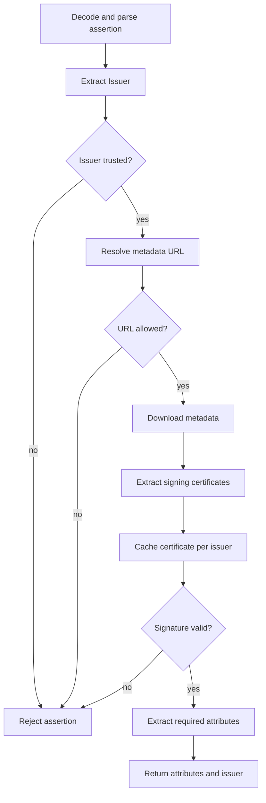

# SAML Auto-Discovery

`SamlValidationService` validates SAML assertions without manual certificate configuration. It discovers the IdP metadata URL, downloads the signing certificate, caches it, and verifies the XML signature before returning attributes.

## Validation pipeline



1) Base64 decode the assertion and parse XML with XXE protections.
2) Extract `<Issuer>`; reject if missing.
3) Trust check:
   - `saml.idp.trust-mode=whitelist` (default): issuer must appear in `saml.trusted.idp`.
   - `saml.idp.trust-mode=any`: accept any issuer with a valid signature.
4) Resolve metadata URL in this order:
   - `saml.idp.metadata.override` (issuer-specific override map),
   - `saml.idp.metadata.url` (global override),
   - assertion hints (`AuthnContext/AuthenticatingAuthority`, then `Extensions/MetadataURL`),
   - fallback `<issuer>/metadata`.
5) Validate metadata URL:
   - HTTPS required by default,
   - HTTP allowed only when `saml.metadata.allow-http=true`,
   - block loopback/private/link-local/cloud metadata targets.
6) Download metadata, select signing certificates from `KeyDescriptor` and parse X.509 certs.
7) Cache the certificate per issuer (ConcurrentHashMap). Cache is in-memory for the process lifetime; `clearCertificateCache()` is available for tests/refresh.
8) Verify `<ds:Signature>` with the discovered certificate; reject missing or invalid signatures.
9) Extract attributes (after signature verification): `userid` (fallback to `NameID`), `affiliation` (required; fallback from `schacHomeOrganization`), `email` or `mail`, `displayName`/`cn`, and `schacHomeOrganization` (multi-value list).
10) Return attributes plus `issuer` for downstream services (SAML auth, institutional check-in, intents).

## Configuration
```properties
# Trust mode
saml.idp.trust-mode=whitelist         # or any
saml.trusted.idp={'uned':'https://idp.uned.es','ucm':'https://idp.ucm.es'}

# Optional metadata URL overrides
saml.idp.metadata.url=
saml.idp.metadata.override={'https://idp.uned.es':'https://idp.uned.es/metadata'}

# Metadata transport hardening
saml.metadata.allow-http=false
```

## Failure modes
- Issuer not in whitelist (when enabled).
- Metadata URL blocked (localhost/private/cloud metadata or invalid scheme).
- No signing certificate in metadata.
- Missing/invalid XML signature.
- Missing required attributes (`userid` / `affiliation`).

## Where it is used
- `POST /auth/authorize-and-issue` (3-layer validation).
- `POST /auth/checkin-institutional`.
- Intent submission flow (`POST /intents`) when SAML assertions are provided.
