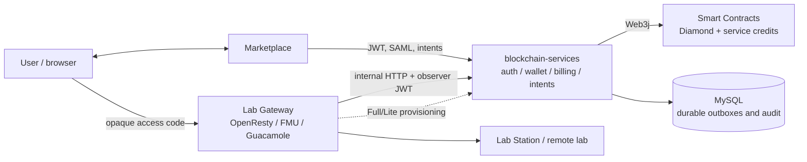
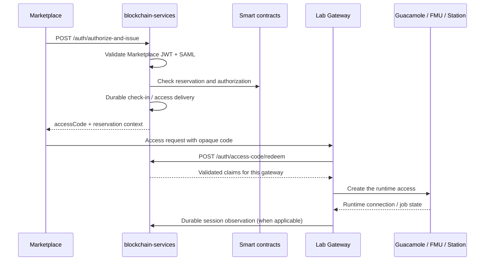
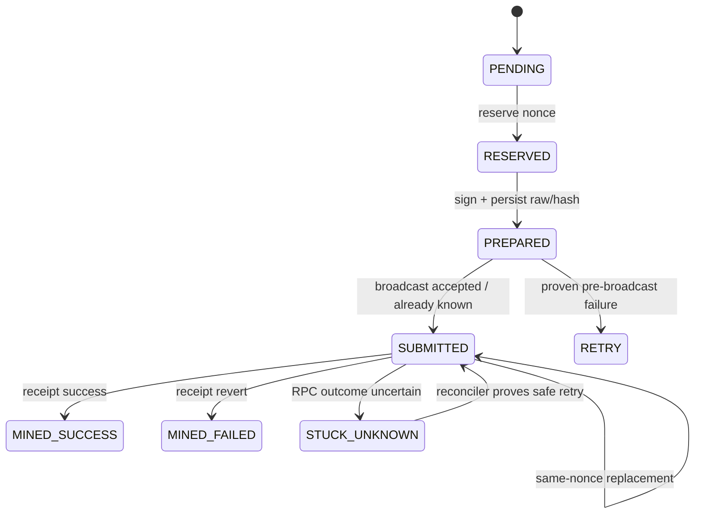

# Architecture and operating model

This document is the short architectural reference for the canonical backend in
`Lab Gateway/blockchain-services`. It describes the deployed boundaries; it is
not a substitute for the endpoint-specific guides.

## Scope and deployment modes

The service is a Spring Boot 4 application running on Java 21. It can be used in
three ways:

| Mode | Typical topology | Provider/auth surface | Consumer/wallet surface |
| --- | --- | --- | --- |
| Full gateway | Lab Gateway + embedded backend | Enabled when `FEATURES_PROVIDERS_ENABLED=true` | Enabled |
| Lite gateway backend | Full gateway delegates to a Lite gateway | The Lite gateway is an access edge; Full remains the auth/provider authority | Enabled at the edge as configured |
| Standalone consumer | This repository without a provider gateway | Disabled by default | Enabled |

`FEATURES_PROVIDERS_ENABLED` is `false` by default in
`src/main/resources/application.properties`. The parent `Lab Gateway` compose
deployment supplies the values required for Full or Lite operation. Do not infer
deployment mode from the repository name; inspect `ISSUER` in the gateway and
the provider feature flags in this service.

## System context

### Trust boundaries

| Boundary | Contract | Source of truth |
| --- | --- | --- |
| Marketplace → backend | Marketplace JWT, SAML assertion, intent payload | Signature, issuer/audience, claim and replay checks |
| Backend → contracts | Web3j transactions and reads | On-chain reservation, credit and provider state |
| Backend → MySQL | Outbox, nonce, ticket, delivery and audit rows | Durable local state and migration schema |
| Gateway → backend | Internal access-code or session-observer credentials | Per-gateway configured credentials; never user-supplied gateway IDs |
| Gateway → Guacamole/FMUs/station | Provisioning and runtime calls | Gateway-side token validation plus backend authorization |

## Access and evidence flow

The browser never receives a signed lab-access JWT in a URL. The backend first
validates identity and booking state, then returns an opaque access code. The
gateway redeems that code once and creates the runtime session.

`SessionStarted` is economic evidence, not a proxy access log. Guacamole
observations are correlated with the exact token and may use durable connection
history to cover a short connection between polls. FMU realtime creation also
requires durable observation before `session.created` is emitted.

## Durable transaction flow

All institutional-wallet producers share chain- and wallet-scoped nonce
ownership. The signed bytes and locally computed hash are persisted before the
first broadcast.

The check-in and `SessionStarted` outboxes have dedicated monitors. Generic
institutional transactions use `institutional_transaction_outbox` and its
monitor. The outbox keeps `original_gas_price` separate from
`current_gas_price`; replacement gas is bounded by the configured absolute
price, original-price multiple, and estimated fee-cost ceilings. A missing
hash is never treated as proof that a transaction was not broadcast.

`SessionStarted` pre-broadcast contention is retryable independently of the
broadcast-attempt limit: it returns to `RETRY`, keeps the reservation guard and
does not spend an attempt. Rows left as legacy `FAILED` without a transaction
hash or signed raw material are automatically reclaimed. `/health` reports
`session_started_failed` and degrades while such a blocker remains.

## Documentation map

- [Authentication and access evidence](../services/authentication/AUTH.md)
- [Intents and provisioning](../services/intents/INTENTS_PROVISIONING.md)
- [Wallet, billing and administration](../services/wallet/WALLET_BILLING.md)
- [Security configuration](../security/SECURITY.md)
- [SAML metadata discovery](../security/SAML_AUTO_DISCOVERY.md)
- [Compliance exports and runbooks](../operations/COMPLIANCE_RUNBOOKS.md)
- [Example lab metadata](../reference/example-lab-metadata.md)

When a document conflicts with a controller, `application.properties`, or a
Flyway migration, the executable configuration is authoritative and the
documentation must be corrected.
