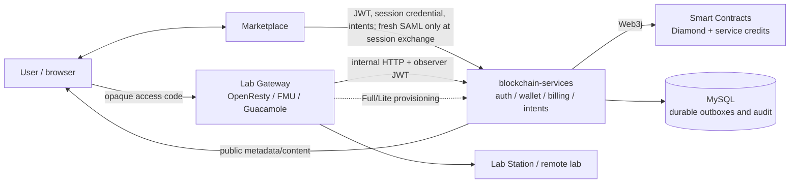
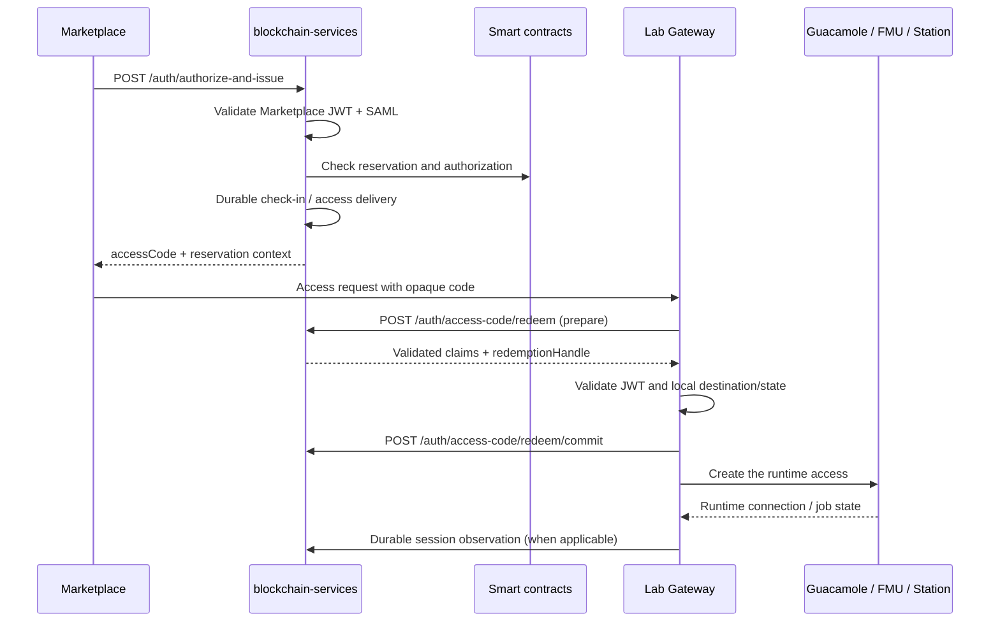
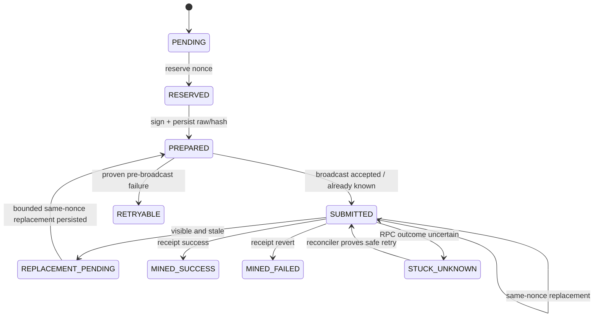

# Architecture and operating model

This document is the short architectural reference for the canonical backend in
`Lab Gateway/blockchain-services`. It describes the deployed boundaries; it is
not a substitute for the endpoint-specific guides.

This checkout is the parallel standalone backend variant. The canonical
embedded implementation for the integrated Gateway is
`Lab Gateway/blockchain-services`; this document describes the corresponding
standalone repository boundary.

## Scope and deployment modes

The service is a Spring Boot 4.1 application running on Java 21. It can be used in
three ways:

| Mode | Typical topology | Provider/auth surface | Consumer/wallet surface |
| --- | --- | --- | --- |
| Full gateway | Lab Gateway + embedded backend | Enabled when backend mode is `provider-consumer` | Enabled |
| Lite gateway edge | A Lite gateway trusts a remote Full gateway | Full remains the auth/provider authority; Lite validates remote issuer/JWKS | Present only when the Lite deployment explicitly needs this backend capability |
| Standalone consumer | This repository without a provider gateway | Enabled only when backend mode is `provider-consumer` | Enabled |

`BLOCKCHAIN_SERVICES_MODE` is the explicit backend role and accepts only
`provider-consumer` or `consumer-only`. It is independent of the Full/Lite
access-plane topology. `FEATURES_PROVIDERS_ENABLED` remains the packaged
fallback for installations that have not added the role setting. Do not infer
the backend role from `ISSUER`, the gateway topology, or the repository name.
The parent `Lab Gateway` compose deployment supplies the values required for
the selected topology, while the backend `.env` owns this role decision.
The provider feature controls the conditional OIDC/JWKS and FMU controllers and
the health operating mode. The SAML controller still contains both provider and
consumer mappings, so the application security chain denies provider-side SAML/
access and `/lab-admin/**` routes in `consumer-only`; the provider Lab Admin
controller is not created. The public `/lab-content/**` read controller remains
common to both roles. Network exposure and the intended topology remain
defense-in-depth controls.

## System context

```mermaid
flowchart LR
    User["User / browser"]
    Marketplace["Marketplace"]
    Gateway["Lab Gateway<br/>OpenResty / FMU / Guacamole"]
    Backend["blockchain-services<br/>auth / wallet / billing / intents"]
    Contracts["Smart Contracts<br/>Diamond + service credits"]
    MySQL[("MySQL<br/>durable outboxes and audit")]
    Station["Lab Station / remote lab"]

    User <--> Marketplace
    Marketplace -->|JWT, session credential, intents; fresh SAML only at session exchange| Backend
    User -->|opaque access code| Gateway
    Gateway -->|internal HTTP + observer JWT| Backend
    Gateway --> Station
    Backend -->|Web3j| Contracts
    Backend --> MySQL
    Backend -->|public metadata/content| User
    Gateway -.->|Full/Lite provisioning| Backend
```

### Trust boundaries

| Boundary | Contract | Source of truth |
| --- | --- | --- |
| Marketplace → backend | Marketplace JWT, institutional session credential and intent/access payload; fresh SAML only at `/auth/saml/session` | Signature, issuer/audience, credential binding, claim and replay checks |
| Backend → contracts | Web3j transactions and reads | On-chain reservation, credit and provider state |
| Backend → MySQL | Outbox, nonce, ticket, delivery and audit rows | Durable local state and migration schema |
| Gateway → backend | Internal access-code or session-observer credentials | Per-gateway configured credentials; never user-supplied gateway IDs |
| Gateway → Guacamole/FMUs/station | Provisioning and runtime calls | Gateway-side token validation plus backend authorization |
| Operator → lab administration | Admin or Lab Manager network/token policy | Institutional provider wallet, content volume and on-chain receipts |

## Access and evidence flow

The browser never receives a signed lab-access JWT in a URL. The backend first
validates identity and booking state, then returns an opaque access code. The
gateway reserves a short-lived redemption handle, validates the JWT and local
destination/state, and commits the code only after those checks pass.

```mermaid
sequenceDiagram
    participant M as Marketplace
    participant B as blockchain-services
    participant C as Smart contracts
    participant G as Lab Gateway
    participant R as Guacamole / FMU / Station

    M->>B: POST /auth/authorize-and-issue
    B->>B: Validate Marketplace JWT + SAML
    B->>C: Check reservation and authorization
    B->>B: Durable check-in / access delivery
    B-->>M: accessCode + reservation context
    M->>G: Access request with opaque code
    G->>B: POST /auth/access-code/redeem (prepare)
    B-->>G: Validated claims + redemptionHandle
    G->>G: Validate JWT and local destination/state
    G->>B: POST /auth/access-code/redeem/commit
    G->>R: Create the runtime access
    R-->>G: Runtime connection / job state
    G->>B: Durable session observation (when applicable)
```

`SessionStarted` is economic evidence, not a proxy access log. Guacamole
observations are correlated with the exact token and may use durable connection
history to cover a short connection between polls. FMU realtime creation also
requires durable observation before `session.created` is emitted.

## Processing and persistence model

MySQL is not just a cache. It owns durable access delivery, WebAuthn
credentials, intent state, audit records, nonce/outbox coordination and the
contract-event journal. Production deployments must persist it together with
`/app/data` and the configured lab-content volume.

Contract events use a durable journal keyed by chain ID, contract address, event
signature, transaction hash, block hash and log index. Logs are processed only
after the configured confirmation depth and a canonical block-hash check. Its
cursor moves only when an event range is safe; retryable failures replay the same
range, and exhausted rows become `DEAD_LETTER` for operator review. Recent rows
are rechecked for reorgs and become `ORPHANED`, which rewinds the cursor so the
replacement canonical range can be reconciled.

The source configuration for external institutional reservation requests uses a
five-minute on-chain pending TTL and requires a ten-minute creation lead. The
default 12-confirmation depth and 15-second polling/retry fallback are bounded
inside that decision window; if finality misses the deadline, the request
expires without confirmation or credit capture. Increasing either
event-processing budget requires an accompanying reviewed Diamond timing
upgrade.

## Durable transaction flow

All institutional-wallet producers share chain- and wallet-scoped nonce
ownership. The signed bytes and locally computed hash are persisted before the
first broadcast.

```mermaid
stateDiagram-v2
    [*] --> PENDING
    PENDING --> RESERVED: reserve nonce
    RESERVED --> PREPARED: sign + persist raw/hash
    PREPARED --> SUBMITTED: broadcast accepted / already known
    SUBMITTED --> REPLACEMENT_PENDING: visible and stale
    REPLACEMENT_PENDING --> PREPARED: bounded same-nonce replacement persisted
    SUBMITTED --> MINED_SUCCESS: receipt success
    SUBMITTED --> MINED_FAILED: receipt revert
    PREPARED --> RETRYABLE: proven pre-broadcast failure
    SUBMITTED --> STUCK_UNKNOWN: RPC outcome uncertain
    STUCK_UNKNOWN --> SUBMITTED: reconciler proves safe retry
    SUBMITTED --> SUBMITTED: same-nonce replacement
```

The check-in and `SessionStarted` outboxes have dedicated monitors. Generic
institutional transactions use `institutional_transaction_outbox` and its
monitor. The outbox keeps `original_gas_price` separate from
`current_gas_price`; replacement gas is bounded by the configured absolute
price, original-price multiple, and estimated fee-cost ceilings. A missing
hash is never treated as proof that a transaction was not broadcast.

Access authorization is deliberately a two-stage saga: the institutional
check-in outbox submits and observes the payer transaction, while the provider
credential endpoint is a fast, retryable read of the reservation state. The
HTTP request never polls for mining and never stages Guacamole before
`ACCESS_AUTHORIZED`; only a later retry that observes the authorized state may
acquire the provisioning lease and activate the lab resource.

`SessionStarted` pre-broadcast contention is retryable independently of the
broadcast-attempt limit: it returns to `RETRY`, keeps the reservation guard and
does not spend an attempt. Transient preparation failures consume the retry
budget; permanent preparation failures become `MANUAL_INTERVENTION` and are
not automatically reopened. A mined revert is `MINED_FAILED`; `/health` reports
it, together with manual-intervention rows and stale `RETRY`/`SUBMITTING` rows.

## Documentation map

- [Authentication and access evidence](../services/authentication/AUTH.md)
- [Intents and provisioning](../services/intents/INTENTS_PROVISIONING.md)
- [Wallet, billing and administration](../services/wallet/WALLET_BILLING.md)
- [Lab administration and content](../services/lab-administration/LAB_ADMINISTRATION.md)
- [Deployment and configuration](../configuration/DEPLOYMENT.md)
- [Security configuration](../security/SECURITY.md)
- [SAML metadata discovery](../security/SAML_AUTO_DISCOVERY.md)
- [API reference](../reference/API_REFERENCE.md)
- [Example lab metadata](../reference/example-lab-metadata.md)

When a document conflicts with a controller, `application.properties`, or a
Flyway migration, the executable configuration is authoritative and the
documentation must be corrected.
