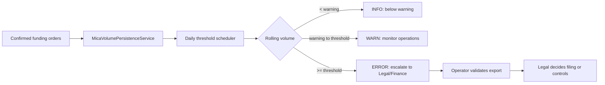
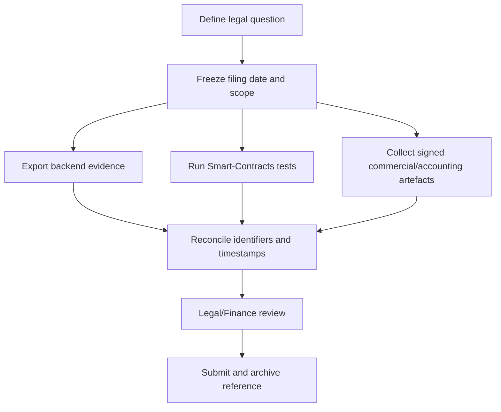

# Compliance and operations runbooks

This document describes the evidence and operator actions implemented by the backend. It is an operational aid, not legal advice: regulatory interpretation, filing deadlines and customer communications remain owned by Legal and Finance.

## 1. MiCA rolling-volume monitoring

`MicaThresholdMonitorScheduler` runs with a one-day fixed delay (default `billing.mica-threshold.interval-ms=86400000`). It reads the latest rolling EUR volume and emits an `INFO`, `WARN` or `ERROR` log at the configured levels. It does not suspend funding orders or file a notification automatically.



Verify the current figure with `GET /billing/compliance/mica-volume`. The implementation does not expose an automatic “freeze” switch; any suspension of new funding orders must be an explicit, reviewed operational change. Defaults are `billing.mica.threshold-eur=1000000` and `billing.mica.warning-pct=80`.

## 2. Provider agreement expiry

`ProviderContractExpiryScheduler` runs daily by default (`billing.provider-contract-expiry.interval-ms=86400000`) and logs providers whose expiry is within `billing.provider-contract.warning-days` (default 30 days). It does not suspend or terminate providers automatically.

1. Review `GET /billing/provider-network` and the scheduler alert.
2. Confirm the signed renewal or the reason for suspension with Operations and Legal.
3. Record the action using the provider-network administration endpoint, preserving `agreementVersion` and `actionBy`.
4. If an on-chain status change is required, execute and verify that separate administrative transaction; this runbook does not imply that the scheduler performs it.

The available write routes are `POST /billing/provider-network`, `POST /billing/provider-network/{id}/suspend` and `POST /billing/provider-network/{id}/terminate`. Treat termination as irreversible unless the contract explicitly provides a recovery path.

## 3. Credit expiry and deferred revenue evidence

`CreditExpiryScheduler` runs hourly (`billing.credit-expiry.interval-ms=3600000`) and marks eligible local `credit_lots` as `expired=true`. It does **not** currently submit an on-chain `expireCredits` transaction. Reconcile the local flag with the chain before posting a journal entry, and do not describe the local update as a token burn.

Use the actual exports:

- `GET /billing/compliance/exports/expired?address=...`
- `GET /billing/compliance/exports/consumed?address=...&limit=...`
- `GET /billing/compliance/exports/prepaid-balances?address=...`
- `GET /billing/compliance/exports/receivable-accruals`

For each accounting adjustment, retain the funding order, lot index, movement/reference and the corresponding on-chain evidence. Expiry warnings and customer wording are product/compliance responsibilities; the scheduler only updates the local persistence record.

## 4. Evidence pack for a regulatory consultation

Build the evidence pack from versioned project documentation, current exports and independently reproducible contract tests. Do not reference untracked “phase” documents or endpoint names that are not implemented.



Current backend exports include:

```text
GET /billing/compliance/exports/mica-volume
GET /billing/compliance/exports/prepaid-balances?address=0x...
GET /billing/compliance/exports/consumed?address=0x...&limit=100
GET /billing/compliance/exports/expired?address=0x...
GET /billing/compliance/exports/receivable-accruals
GET /billing/compliance/exports/completed-payouts?providerAddress=0x...
GET /billing/compliance/exports/provider-network
```

For contract evidence, run the relevant Foundry tests from `Smart-Contracts/` and record the commit, compiler/toolchain version and command output. Assemble product description, non-transferability evidence, accounting policy, provider-network scope and the export timestamp in one immutable filing bundle.

## 5. Operational evidence checklist

Before closing a review, verify:

- scheduler logs are retained and alert delivery is tested;
- exports are generated with the required address/date filters and reconciled to the chain;
- provider actions include operator identity and agreement version;
- local credit expiry is not presented as an on-chain state transition;
- any funding freeze, suspension or filing has an explicit owner and approval record.
