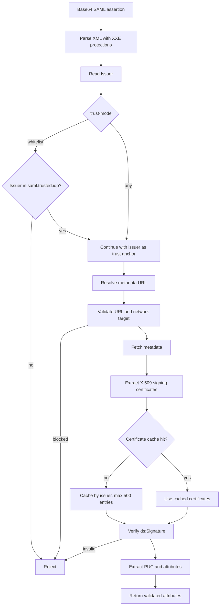

# SAML metadata discovery and signature validation

`SamlValidationService` validates the XML signature before exposing identity attributes to the authentication, institutional check-in and intent flows. It discovers signing certificates from IdP metadata; it is not an IdP registry or a replacement for the gateway network boundary.

## Effective trust model

The packaged `application.properties` sets `saml.idp.trust-mode=any` unless `SAML_IDP_TRUST_MODE` is supplied. That is convenient for development, but production deployments should use `whitelist` and configure `saml.trusted.idp`. The Java field default is only a fallback when Spring is started without the packaged property file.



## Resolution order

For an assertion with issuer `I`, the service resolves the metadata URL in this order:

1. `saml.idp.metadata.override` map entry for `I`.
2. The optional global `saml.idp.metadata.url` property.
3. `AuthnContext/AuthenticatingAuthority` when it looks like a metadata endpoint.
4. An `Extensions/MetadataURL` element.

Metadata transport rejects non-HTTPS URLs unless `saml.metadata.allow-http=true`, and blocks loopback, private, link-local and cloud-metadata targets. HTTP timeouts are configured under `saml.metadata.http.*`.

## Certificate cache and rotation

Certificates are cached in memory by issuer in a bounded `ConcurrentHashMap` (maximum 500 issuers). There is no time-based expiry or cross-instance sharing. A process restart or `clearCertificateCache()` refreshes keys; planned key rotation therefore requires an operational cache clear/restart or a deployment that does not rely on stale certificates.

## Configuration

```properties
# Production baseline
saml.idp.trust-mode=whitelist
saml.trusted.idp={'uned':'https://idp.uned.es','ucm':'https://idp.ucm.es'}

# Optional issuer-specific or global metadata overrides
saml.idp.metadata.override={'https://idp.uned.es':'https://idp.uned.es/metadata'}
saml.idp.metadata.url=

# Metadata transport hardening
saml.metadata.allow-http=false
saml.metadata.http.connect-timeout-ms=5000
saml.metadata.http.read-timeout-ms=10000
saml.metadata.http.call-timeout-ms=15000
```

## Required identity data and failure modes

Signature verification happens before attributes are returned. The service then derives the stable PUC from `eduPersonPrincipalName` and/or `eduPersonTargetedID`, and resolves institution affiliation from `schacHomeOrganization`, scoped affiliation or email. Missing issuer, an untrusted issuer, blocked metadata, absent certificates, invalid signatures or missing PUC identity are authentication failures.

The service is used by:

- `POST /auth/authorize-and-issue` and `POST /auth/access-credential`;
- `POST /auth/checkin-institutional`;
- `POST /intents` when a SAML assertion is supplied.
