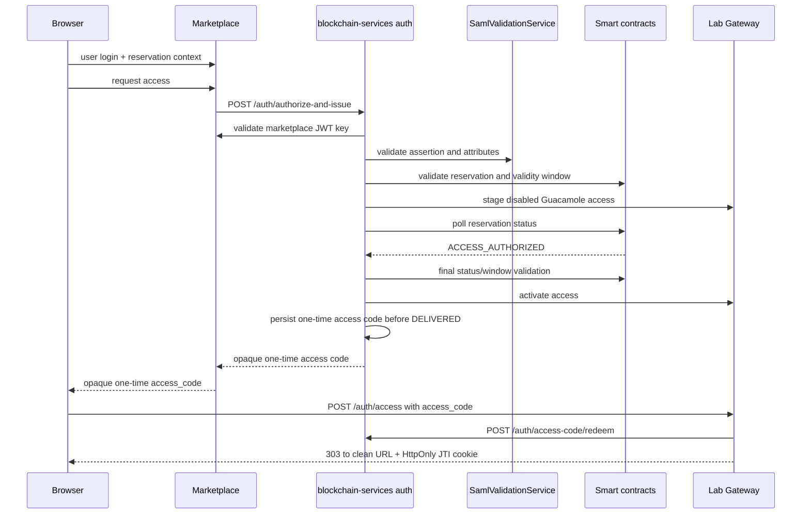

# Authentication Service

This service issues JWTs through the institutional SAML flow with marketplace token cross-validation.

Important runtime switch:

- Auth controllers are enabled only when `features.providers.enabled=true`.
- Repository default is `false` (`application.properties`), so `/auth/*` endpoints are disabled unless enabled.

## SAML Flow

Endpoints:

- `POST /auth/authorize-and-issue`
- `POST /auth/access-credential`
- `POST /auth/checkin-institutional`
- `POST /auth/access-code/redeem` (single-use redemption)

Request body:

```json
{
  "marketplaceToken": "<marketplace JWT>",
  "samlAssertion": "<base64 SAML assertion>",
  "labId": "42",
  "reservationKey": "0x..."
}
```



Validation pipeline:

1. Validate marketplace JWT signature using key from `marketplace.public-key-url`.
2. Validate SAML assertion signature and required attributes using `SamlValidationService`.
3. Cross-check `userid` and `affiliation` between marketplace JWT and SAML attributes.
4. Cross-check `payerInstitutionWallet` with the authenticated institution; this claim identifies the payer institution, not the lab provider wallet.
5. Booking-aware access endpoints enforce booking entitlement:
   - `bookingInfoAllowed=true` OR
   - required scope (`auth.saml.required-booking-scope`, default `booking:read`).

Institutional check-in is handled through `/auth/checkin-institutional` and derives the signer context from the validated institutional request instead of a customer wallet-signature challenge.

For separate consumer and provider backends, check-in returns after transaction submission with its `txHash`; it does not wait for the receipt. The provider validates the Marketplace JWT and reservation (including the validity window), stages a physical Guacamole user disabled and without connection permissions, and prepares the access claims. Each attempt has a durable fencing token, generation, heartbeat and expiry; status changes and rollback ownership are conditional on that token. It also uses a distinct temporary Guacamole user, so a stale attempt cannot activate or delete the current attempt's user. The same lease is acquired when `ACCESS_AUTHORIZED` is already visible, closing the fast-path race with a provisional request. The JWT is signed, audited, and returned only after the reservation reaches `ACCESS_AUTHORIZED`; the provider polls only the reservation status for at most 27 seconds (`auth.access-authorization.wait-timeout-ms`), refreshing its lease on every poll, then performs a final full reservation/window validation before activating Guacamole. On timeout it returns `503 ACCESS_AUTHORIZATION_PENDING` with `Retry-After: 1` and removes only its own temporary Guacamole user. If the authorization transaction is mined reverted, it returns `409 ACCESS_AUTHORIZATION_REJECTED`. No JWT has been signed or persisted before authorization. OpenResty allows 60 seconds for `/auth`, so provisioning plus fenced cleanup can return that structured response instead of being cut off by the proxy.

When consumer and provider are the same backend, `/auth/authorize-and-issue` persists the institutional check-in in the local outbox and immediately claims and broadcasts it before staging provider access. The scheduled worker remains the durable recovery path for uncertain broadcasts and follows the same `ACCESS_AUTHORIZED` gate before activation and issuance.

The institutional check-in outbox separates transaction submission from receipt monitoring. Its lifecycle is `PENDING → SUBMITTING → SUBMITTED → MINED_SUCCESS` or `MINED_FAILED`, with `RETRY` and terminal `FAILED` for submission errors. Enqueue is idempotent: an existing row is never reset or reopened, so a transmitted hash and nonce cannot be reused accidentally. A later, fully revalidated access request may explicitly restart only `MINED_FAILED` or `FAILED`; that creates a clean generation by clearing the prior hash, nonce and submission timestamps. A submission worker persists the hash and a separate receipt monitor checks mining status. Nonces are allocated and persisted per signing wallet under a database row lock, so distinct reservations can be transmitted concurrently up to the wallet nonce order without waiting for receipts; an uncertain broadcast retains its reserved nonce for reconciliation/retry.

The required submission and receipt workers run every two seconds by default and cannot be disabled independently of the access flow. A transaction still pending after 15 seconds is repriced with its reserved nonce, which gives the replacement a chance to help the 27-second provider wait. Successful replacement broadcasts count toward the same configured `institutional.checkin.outbox.max-attempts` limit as failed broadcasts; reaching that limit produces terminal `FAILED`, bounding both replacement count and the derived gas escalation. The local broadcast lock is keyed by wallet rather than globally by JVM. Ethereum nonce ordering still permits head-of-line blocking when an earlier nonce is stuck; this is monitored and repriced but cannot be removed at the application layer.

`SessionStarted` attestations use the same durable wallet dispatcher and `institutional_wallet_nonce` sequence. Their transaction lifecycle is `QUEUED`, `SUBMITTING`, `SUBMITTED`, `MINED_SUCCESS`, `MINED_FAILED`, `RETRY`, and `FAILED`. The publisher stops after persisting `txHash`; receipt monitoring and bounded same-nonce gas replacement run separately, so a slow transaction does not block the attestation batch.

The booking flow uses `/auth/authorize-and-issue`.

For Guacamole and FMU resources, the provider creates and persists a 60-second opaque access code before it audits issuance and marks the fenced provisioning lease `DELIVERED`; Marketplace receives only that code and resource URL. A revalidated retry after a lost provider response recovers the current unconsumed delivery by reservation and generation. If the code TTL elapsed but the credential remains valid, only the opaque code is refreshed; the provider does not create another user or credential. OpenResty redeems the code once with `AUTH_ACCESS_CODE_REDEEMER_TOKEN`. Guacamole receives a secure JTI cookie and clean redirect. FMU receives a Secure, HttpOnly `FMU_SESSION` cookie, and OpenResty injects the technical bearer on calls to both the web simulation API and proxy-FMU download API. Codes use the persistent database atomically whenever a datasource exists; in-memory storage is used only without a datasource.

When Guacamole accepts a reservation WebSocket (`101`), OpenResty captures that opening timestamp and makes up to three authenticated attempts to hand it to Ops Worker. The Ops Worker writes the local MySQL observation outbox; OpenResty does not receive database credentials. Durability starts at that insert, so a process loss before the bounded handoff completes remains a documented residual risk. The worker delivers to `/access-audit/internal/session-observed` with retry/backoff and marks it sent only when the backend replies with `recorded=true`, meaning that both the local audit and the SessionStarted attestation are durable. Tunnel closure is not used as an observation timestamp.

`SessionStarted` publication shares `InstitutionalWalletTransactionDispatcher` with check-in. It persists an explicit nonce and transaction hash without waiting for a receipt; a separate monitor records mining, reverts and bounded same-nonce replacements. In Lite mode, `ACCESS_AUDIT_URL` targets Full and Ops Worker signs a 60-second JWT with its per-gateway secret. Full grants only `ROLE_SESSION_OBSERVER` and verifies `gatewayId`, audience and `session-observation:submit`; `ADMIN_ACCESS_TOKEN` is not accepted for this POST. Setup imports the required redeemer endpoint/credential, audit endpoint and observer identity from a Full-issued trust bundle.

Guacamole token revocation is scheduled durably at JWT expiry even if no active connection exists. OpenResty first writes an atomic local spool entry; Ops Worker encrypts the token into `guacamole_token_revocation_queue` and removes the file only after insertion. Security mappings remain for `exp + API_SESSION_TIMEOUT + 5 minutes`, and Ops Worker retries revocation independently of WebSocket activity.

Future hardening: replace the fallback that derives a provisioner endpoint from `accessURI` with an explicit per-gateway registry containing an allowed origin and a gateway-specific credential. The fallback remains unchanged in this version.

SAML trust defaults:

- `saml.idp.trust-mode=whitelist` (default)
- `saml.trusted.idp={...}` map is used in whitelist mode
- Metadata URL resolution supports per-issuer/global overrides and assertion hints
- HTTPS metadata required by default (`saml.metadata.allow-http=false`)

## Discovery and Keys

- `GET /.well-known/openid-configuration`
- `GET /auth/jwks`

JWT signing keys:

- `PRIVATE_KEY_PATH` (default `/app/config/keys/private_key.pem`)
- `PUBLIC_KEY_PATH` (default `/app/config/keys/public_key.pem`)

## Error Semantics

- `400` invalid input / missing fields
- `401` authentication/signature/scope failures
- `409` access-authorization transaction rejected on-chain
- `503` upstream metadata/service unavailable (SAML mapped failures)
- `503` `ACCESS_AUTHORIZATION_PENDING` while on-chain authorization is not yet visible (`Retry-After: 1`)
- `500` unexpected internal errors

## Deliberately Deferred Work

- Marketplace does not currently retry `503 ACCESS_AUTHORIZATION_PENDING` from `Retry-After`; the user may need to request access again. Backend idempotency preserves the existing transaction and current unconsumed delivery.
- `lab_access_codes.access_token` remains plaintext in MySQL until cleanup. Database isolation has been tightened, but application-level encryption with an external key is future defense in depth.
- Session observation uses three OpenResty-to-Ops-Worker attempts and metrics; a persistent ingress queue for that pre-outbox hop remains future hardening.
- The provisioner endpoint fallback derived from `accessURI` remains enabled. Replace it with an explicit gateway registry before treating untrusted laboratory metadata as a provisioning authority.

The provider continues to wait for on-chain `ACCESS_AUTHORIZED` for up to 27 seconds by design. This is a strong-consistency access rule, not a pending retry optimization.
