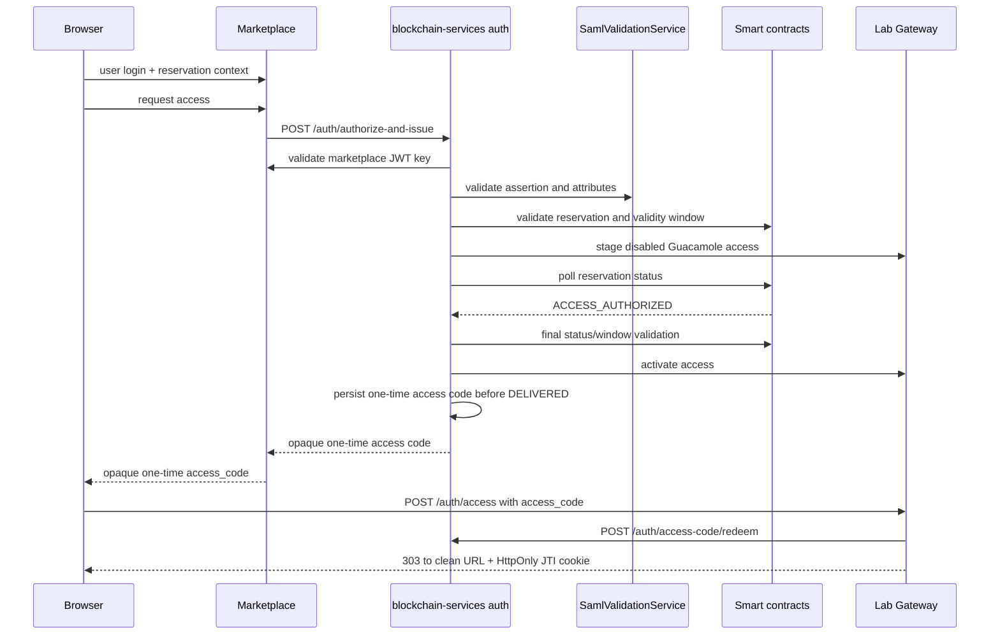

# Authentication Service

This service issues JWTs through the institutional SAML flow with marketplace token cross-validation.

Important runtime switch:

- Auth controllers are enabled only when `features.providers.enabled=true`.
- Repository default is `false` (`application.properties`), so `/auth/*` endpoints are disabled unless enabled.

## SAML Flow

Endpoints:

- `POST /auth/authorize-and-issue`
- `POST /auth/access-credential`
- `POST /auth/checkin-institutional`
- `POST /auth/access-code/redeem` (single-use redemption)

Request body:

```json
{
  "marketplaceToken": "<marketplace JWT>",
  "samlAssertion": "<base64 SAML assertion>",
  "labId": "42",
  "reservationKey": "0x..."
}
```



Validation pipeline:

1. Validate marketplace JWT signature using key from `marketplace.public-key-url`.
2. Validate SAML assertion signature and required attributes using `SamlValidationService`.
3. Cross-check `userid` and `affiliation` between marketplace JWT and SAML attributes.
4. Cross-check `payerInstitutionWallet` with the authenticated institution; this claim identifies the payer institution, not the lab provider wallet.
5. Booking-aware access endpoints enforce booking entitlement:
   - `bookingInfoAllowed=true` OR
   - required scope (`auth.saml.required-booking-scope`, default `booking:read`).

Institutional check-in is handled through `/auth/checkin-institutional` and derives the signer context from the validated institutional request instead of a customer wallet-signature challenge.

For separate consumer and provider backends, check-in returns after transaction submission with its `txHash`; it does not wait for the receipt. The provider validates the Marketplace JWT and reservation (including the validity window), stages a physical Guacamole user disabled and without connection permissions, and prepares the access claims. Each attempt has a durable fencing token, generation, heartbeat and expiry; status changes and rollback ownership are conditional on that token. It also uses a distinct temporary Guacamole user, so a stale attempt cannot activate or delete the current attempt's user. The same lease is acquired when `ACCESS_AUTHORIZED` is already visible, closing the fast-path race with a provisional request. The JWT is signed, audited, and returned only after the reservation reaches `ACCESS_AUTHORIZED`; the provider polls only the reservation status for at most 27 seconds (`auth.access-authorization.wait-timeout-ms`), refreshing its lease on every poll, then performs a final full reservation/window validation before activating Guacamole. On timeout it returns `503 ACCESS_AUTHORIZATION_PENDING` with `Retry-After: 1` and removes only its own temporary Guacamole user. If the authorization transaction is mined reverted, it returns `409 ACCESS_AUTHORIZATION_REJECTED`. No JWT has been signed or persisted before authorization. OpenResty allows 60 seconds for `/auth`, so provisioning plus fenced cleanup can return that structured response instead of being cut off by the proxy.

When consumer and provider are the same backend, `/auth/authorize-and-issue` persists the institutional check-in in the local outbox and immediately claims and broadcasts it before staging provider access. The scheduled worker remains the durable recovery path for uncertain broadcasts and follows the same `ACCESS_AUTHORIZED` gate before activation and issuance.

The institutional check-in outbox separates transaction submission from receipt monitoring. Its lifecycle is `PENDING → SUBMITTING → SUBMITTED → MINED_SUCCESS` or `MINED_FAILED`, with `RETRY`, terminal `FAILED` for proven pre-broadcast errors, and `STUCK_UNKNOWN` when an RPC outcome is uncertain. Enqueue is idempotent: an existing row is never reset or reopened, so a transmitted hash and nonce cannot be reused accidentally. A signed raw transaction and its locally computed hash are persisted before the first RPC; a later, fully revalidated access request may explicitly restart only `MINED_FAILED` or `FAILED`; `STUCK_UNKNOWN` retains ownership until the contract state and node pending nonce prove that retrying is safe. A separate receipt monitor checks mining status and can rebroadcast the exact signed bytes. Recovery of a stale `SUBMITTING` row first looks up its persisted hash and rebroadcasts the persisted raw transaction; it does not overwrite that evidence with a replacement before the old attempt is classified. Nonces are allocated and persisted by `(chain_id, wallet_address)` under a database row lock. Generic institutional producers use `institutional_transaction_outbox`: the signed raw transaction, nonce and expected hash are durable before broadcast, replacements reuse that same nonce, and an unresolved row blocks later allocations until RPC reconciliation proves the nonce was accepted. This prevents intents, lab administration or event automation from creating a hole in the shared sequence used by check-in and `SessionStarted`.

The required submission and receipt workers run every two seconds by default and cannot be disabled independently of the access flow. A transaction still pending after 15 seconds is repriced with its reserved nonce, which gives the replacement a chance to help the 27-second provider wait. Successful replacement broadcasts count toward the same configured `institutional.checkin.outbox.max-attempts` limit as failed broadcasts; reaching that limit produces terminal `FAILED`, bounding both replacement count and the derived gas escalation. The local broadcast lock is keyed by wallet rather than globally by JVM. Ethereum nonce ordering still permits head-of-line blocking when an earlier nonce is stuck; this is monitored and repriced but cannot be removed at the application layer.

`SessionStarted` attestations use the same durable wallet dispatcher and chain-scoped `institutional_wallet_nonce` sequence. Their transaction lifecycle additionally uses `STUCK_UNKNOWN`; the reservation guard is retained while the contract state and sender nonce are reconciled. The publisher stops after persisting `txHash`; receipt monitoring and bounded same-nonce gas replacement run separately, so a slow transaction does not block the attestation batch.

The booking flow uses `/auth/authorize-and-issue`.

For Guacamole and FMU resources, the provider audits issuance, persists an opaque access code, and only then marks the fenced provisioning lease `DELIVERED`. Marketplace receives `accessCode`, `labURL`, the provider-validated `resourceType`, and the canonical `reservationKey`; the UI never infers the authorized access type from editable Marketplace metadata. A revalidated retry after a lost provider response recovers the current unconsumed delivery by reservation and generation. If the code TTL elapsed but the credential remains valid, only the opaque code is refreshed; the provider does not create another user or credential. Code expiry is `min(now + code TTL, credential expiry)`, so redemption cannot consume an already-expired bearer.

The durable delivery lifecycle is `PREPARED → ACTIVATED → CODE_PERSISTED → DELIVERED → CONSUMED`, with `REVOKED`, `ROLLING_BACK`, `ROLLED_BACK`, and `FAILED` recovery outcomes. Persisting the encrypted bearer, encrypted recoverable code, and the `CODE_PERSISTED` transition is one database transaction. A crash before `DELIVERED` therefore leaves a recoverable generation rather than allowing a second one to be claimed. Starting a later generation revokes bearer material from older generations, and the database permits only one delivery row per reservation/generation. After redemption, both encrypted secrets are cleared and the saga becomes `CONSUMED`.

OpenResty redeems the code once with its gateway-specific credential from `ACCESS_CODE_REDEEMER_CREDENTIALS_JSON` and sends its `X-Gateway-ID`; the code can only be consumed by its signed target gateway. Guacamole receives a secure JTI cookie and clean redirect. FMU gateway credentials remain server-side. Codes use the persistent database atomically whenever a datasource exists; in-memory storage is used only without a datasource. `ACCESS_CODE_ENCRYPTION_KEY` must contain a Base64URL-encoded 32-byte AES key in persistent deployments.

OpenResty's access phase never creates session evidence. Ops Worker correlates Guacamole's point-in-time `activeConnections` view, with durable `guacamole_connection_history` as a fallback for short-lived tunnels, to the encrypted token record. It verifies the exact user token when the connection is active before committing the local MySQL observation outbox. Invalid or rejected tunnels therefore cannot create `SessionStarted`. The worker delivers to `/access-audit/internal/session-observed` with retry/backoff and marks it sent only when the backend replies with `recorded=true`, meaning that both the local audit and signed attestation are durable.

FMU session-ticket redemption requires the same 60-second, per-gateway observer JWT, must match the ticket's signed `targetGatewayId`, and only exchanges the ticket for validated claims. Redemption has an independent token bucket per authenticated gateway (`rate.limit.fmu.session-ticket.requests.*`); ticket issuance remains protected by the shared IP-based public-auth bucket. It does not accept `gatewayId`, `sessionId` or timestamps as observation evidence and never creates an attestation. FMU Runner treats durable observation as the execution acceptance gate: local workers and station HTTP/stream jobs are released only after the observation succeeds, while realtime `session.created` is emitted only after its observation succeeds. Tickets are reservation-window reusable for reconnection, hashed at rest, and their claims are AES-GCM encrypted. Persistent deployments fail closed if the ticket database is unavailable.

`SessionStarted` publication persists an explicit chain ID, nonce, signed raw transaction and locally computed transaction hash before the first RPC; a separate monitor records mining, reverts and bounded same-nonce replacements, rebroadcasting the exact signed bytes when an outcome is uncertain. In Lite mode, `ACCESS_AUDIT_URL` targets Full and each gateway signs its scoped observer JWT with its own secret. Full derives `gatewayId` from that identity and grants only `ROLE_SESSION_OBSERVER`; `ADMIN_ACCESS_TOKEN` is not accepted. Setup imports the required endpoints and observer identity from a Full-issued trust bundle.

Guacamole token revocation is scheduled durably at JWT expiry even if no active connection exists. OpenResty first writes an atomic local spool entry; Ops Worker encrypts the token into `guacamole_token_revocation_queue` and removes the file only after insertion. Security mappings remain for `exp + API_SESSION_TIMEOUT + 5 minutes`, and Ops Worker retries revocation independently of WebSocket activity.

Remote Guacamole provisioning requires an explicit `GUACAMOLE_PROVISIONER_ROUTES_JSON` entry. Full's Lite enrollment records the exact origin and a credential specific to that Lite; an unmapped remote `accessURI` fails closed and is never derived with a shared secret.

SAML trust defaults:

- `saml.idp.trust-mode=whitelist` (default)
- `saml.trusted.idp={...}` map is used in whitelist mode
- Metadata URL resolution supports per-issuer/global overrides and assertion hints
- HTTPS metadata required by default (`saml.metadata.allow-http=false`)

## Discovery and Keys

- `GET /.well-known/openid-configuration`
- `GET /auth/jwks`

JWT signing keys:

- `PRIVATE_KEY_PATH` (default `/app/config/keys/private_key.pem`)
- `PUBLIC_KEY_PATH` (default `/app/config/keys/public_key.pem`)

## Error Semantics

- `400` invalid input / missing fields
- `401` authentication/signature/scope failures
- `409` access-authorization transaction rejected on-chain
- `503` upstream metadata/service unavailable (SAML mapped failures)
- `503` `ACCESS_AUTHORIZATION_PENDING` while on-chain authorization is not yet visible (`Retry-After: 1`)
- `500` unexpected internal errors

## Operational Consistency

- Full mode provisions remote Lite gateways only through exact-origin entries in `GUACAMOLE_PROVISIONER_ROUTES_JSON`. No endpoint is derived from untrusted `accessURI` metadata, and each Lite route uses its own provisioner token.

The provider continues to wait for on-chain `ACCESS_AUTHORIZED` for up to 27 seconds by design. This is a strong-consistency access rule, not a pending retry optimization.
