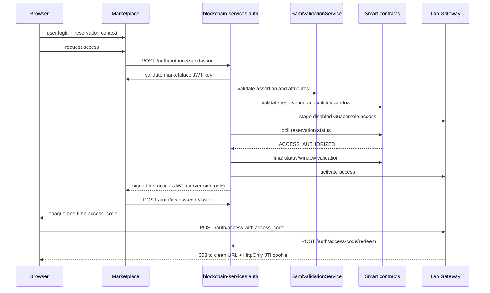

# Authentication Service

This service issues JWTs through the institutional SAML flow with marketplace token cross-validation.

Important runtime switch:

- Auth controllers are enabled only when `features.providers.enabled=true`.
- Repository default is `false` (`application.properties`), so `/auth/*` endpoints are disabled unless enabled.

## SAML Flow

Endpoints:

- `POST /auth/authorize-and-issue`
- `POST /auth/access-credential`
- `POST /auth/checkin-institutional`
- `POST /auth/access-code/issue` (server-side, short-lived browser hand-off)
- `POST /auth/access-code/redeem` (single-use redemption)

Request body:

```json
{
  "marketplaceToken": "<marketplace JWT>",
  "samlAssertion": "<base64 SAML assertion>",
  "labId": "42",
  "reservationKey": "0x..."
}
```



Validation pipeline:

1. Validate marketplace JWT signature using key from `marketplace.public-key-url`.
2. Validate SAML assertion signature and required attributes using `SamlValidationService`.
3. Cross-check `userid` and `affiliation` between marketplace JWT and SAML attributes.
4. Cross-check `payerInstitutionWallet` with the authenticated institution; this claim identifies the payer institution, not the lab provider wallet.
5. Booking-aware access endpoints enforce booking entitlement:
   - `bookingInfoAllowed=true` OR
   - required scope (`auth.saml.required-booking-scope`, default `booking:read`).

Institutional check-in is handled through `/auth/checkin-institutional` and derives the signer context from the validated institutional request instead of a customer wallet-signature challenge.

For separate consumer and provider backends, check-in returns after transaction submission with its `txHash`; it does not wait for the receipt. The provider validates the Marketplace JWT and reservation (including the validity window), stages a physical Guacamole user disabled and without connection permissions, and prepares the access claims. The JWT is signed, audited, and returned only after the reservation reaches `ACCESS_AUTHORIZED`; the provider polls only the reservation status for at most 27 seconds (`auth.access-authorization.wait-timeout-ms`), then performs a final full reservation/window validation before activating Guacamole. On timeout it returns `503 ACCESS_AUTHORIZATION_PENDING` with `Retry-After: 1` and removes the temporary Guacamole user. If the authorization transaction is mined reverted, it returns `409 ACCESS_AUTHORIZATION_REJECTED`. No JWT has been signed or persisted before authorization.

When consumer and provider are the same backend, `/auth/authorize-and-issue` queues the institutional check-in in the local outbox, stages the provider access, and follows the same `ACCESS_AUTHORIZED` gate before activation and issuance.

The institutional check-in outbox separates transaction submission from receipt monitoring. Its lifecycle is `PENDING → SUBMITTING → SUBMITTED → MINED_SUCCESS` or `MINED_FAILED`, with `RETRY` and terminal `FAILED` for submission errors. A submission worker persists the hash and a separate receipt monitor checks mining status. Nonces are allocated and persisted per signing wallet under a database row lock, so distinct reservations can be transmitted concurrently up to the wallet nonce order without waiting for receipts; an uncertain broadcast retains its reserved nonce for reconciliation/retry.

The booking flow uses `/auth/authorize-and-issue`.

The browser never receives a lab-access JWT in a URL or JSON response. Marketplace exchanges the credential for a 60-second opaque access code; OpenResty redeems it once, sets the secure JTI cookie and redirects to a clean Guacamole URL.

SAML trust defaults:

- `saml.idp.trust-mode=whitelist` (default)
- `saml.trusted.idp={...}` map is used in whitelist mode
- Metadata URL resolution supports per-issuer/global overrides and assertion hints
- HTTPS metadata required by default (`saml.metadata.allow-http=false`)

## Discovery and Keys

- `GET /.well-known/openid-configuration`
- `GET /auth/jwks`

JWT signing keys:

- `PRIVATE_KEY_PATH` (default `/app/config/keys/private_key.pem`)
- `PUBLIC_KEY_PATH` (default `/app/config/keys/public_key.pem`)

## Error Semantics

- `400` invalid input / missing fields
- `401` authentication/signature/scope failures
- `409` access-authorization transaction rejected on-chain
- `503` upstream metadata/service unavailable (SAML mapped failures)
- `503` `ACCESS_AUTHORIZATION_PENDING` while on-chain authorization is not yet visible (`Retry-After: 1`)
- `500` unexpected internal errors
