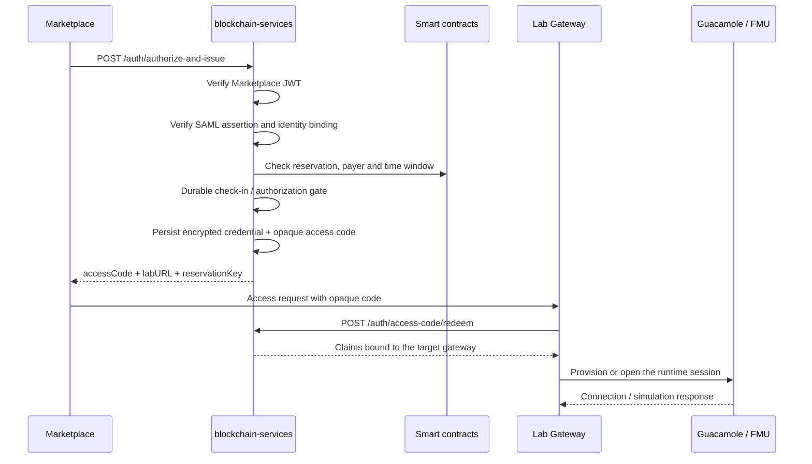
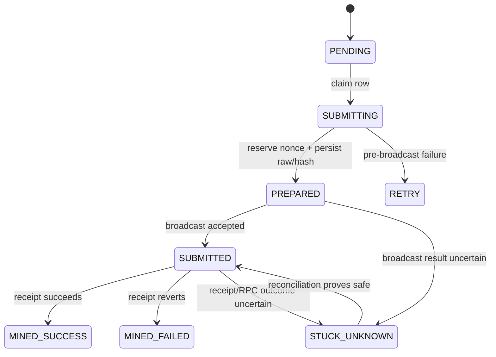
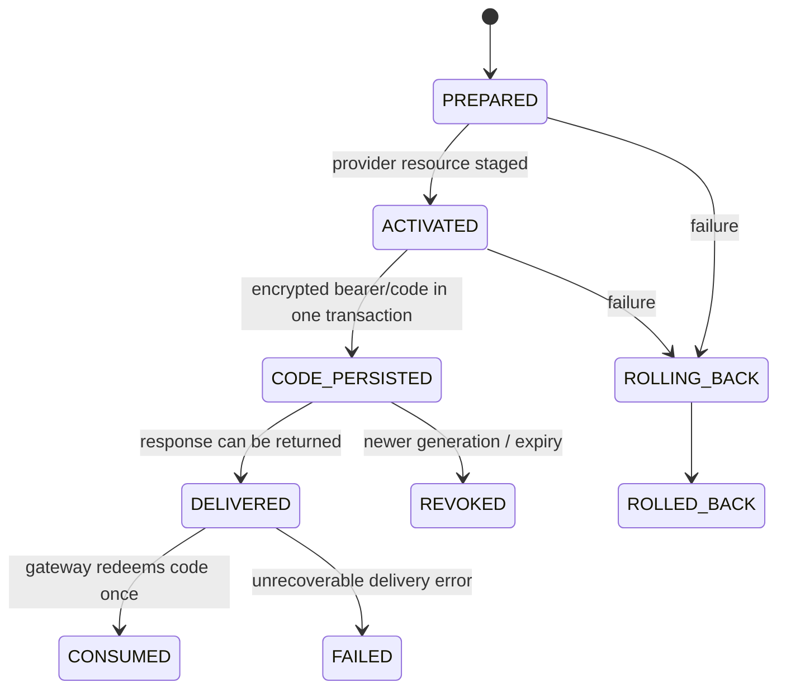
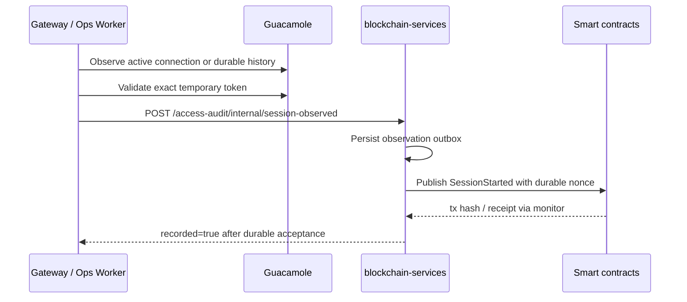
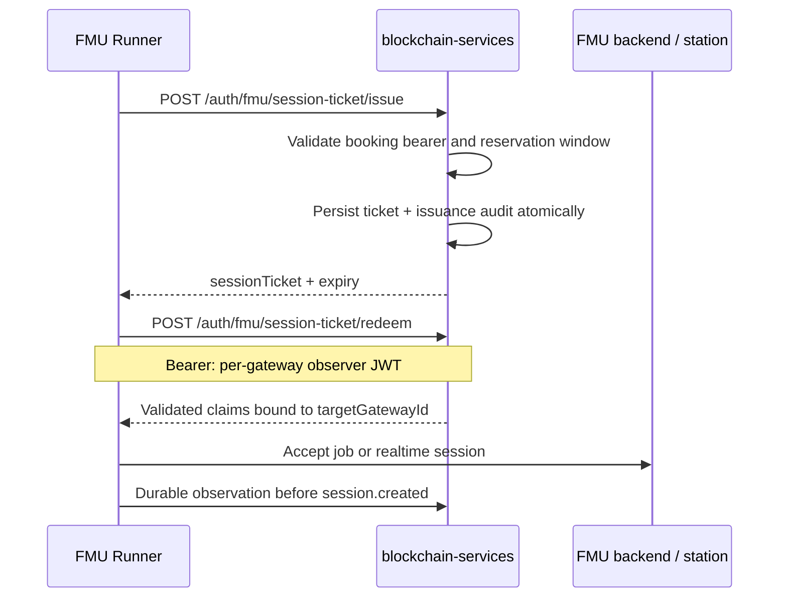

# Authentication, access delivery and session evidence

This guide describes the authentication boundary owned by
`blockchain-services` and the evidence boundary shared with Lab Gateway and
Ops Worker.

## Runtime boundary

The SAML/provider controllers are created only when
`features.providers.enabled=true` (`FEATURES_PROVIDERS_ENABLED=true`). The
repository default is `false`, so a consumer-only standalone instance does not
publish the provider authentication surface.

| Endpoint | Purpose | Primary proof |
| --- | --- | --- |
| `POST /auth/authorize-and-issue` | Validate a booking and deliver access | Marketplace JWT + SAML + on-chain state |
| `POST /auth/access-credential` | Provider-side access credential flow | Provider request + booking checks |
| `POST /auth/checkin-institutional` | Institutional wallet check-in | Institutional request and configured delegation policy |
| `POST /auth/access-code/redeem` | One-time browser/gateway delivery | Gateway ID + per-gateway redeemer credential |
| `POST /auth/fmu/session-ticket/issue` | Issue reusable FMU ticket | Booking bearer and reservation window |
| `POST /auth/fmu/session-ticket/redeem` | Exchange FMU ticket for claims | Per-gateway session-observer JWT |
| `POST /access-audit/internal/session-observed` | Receive durable runtime observation | Per-gateway session-observer JWT |

The backend never treats a request arriving at OpenResty as proof that a lab
session was actually accepted or used.

## Browser access flow

The signed lab-access JWT remains server-side. Marketplace receives an opaque
single-use `accessCode`; OpenResty redeems it by POST, sets the secure JTI
cookie and redirects to a clean URL.



### Validation order

The exact validator varies by endpoint, but booking-aware provider flows must
establish all of the following before issuing access material:

1. Marketplace JWT signature, issuer, audience and expiry.
2. SAML signature, issuer trust and required attributes.
3. Identity equality between the Marketplace token and SAML assertion.
4. Payer institution and wallet authorization.
5. Reservation identity, lab identity and validity window.
6. On-chain authorization (`ACCESS_AUTHORIZED`) when the flow requires it.

`payerInstitutionWallet` identifies the payer institution; it is not silently
substituted with the lab provider wallet.

## Authorization and check-in

`/auth/authorize-and-issue` may wait up to
`auth.access-authorization.wait-timeout-ms` (27 seconds by default) for the
authorization state to become visible. A timeout is retryable and returns:

```http
503 Service Unavailable
Retry-After: 1
```

```json
{
  "error": "ACCESS_AUTHORIZATION_PENDING",
  "retryable": true,
  "reservationKey": "0x...",
  "txHash": "0x..."
}
```

If the authorization transaction is mined and reverted, the endpoint returns
`409 ACCESS_AUTHORIZATION_REJECTED`. No signed access JWT is issued before the
authorization gate succeeds.

When provider and consumer are separate backends, the provider can delegate the
institutional check-in to the payer institution's registered backend. When they
are the same backend, the request is persisted to the local check-in outbox and
the scheduled worker is the recovery path.

### Check-in transaction lifecycle



Important invariants:

- Nonces are durable and scoped by `(chain_id, wallet_address)`.
- The signed raw transaction and locally computed hash are persisted before the
  first `eth_sendRawTransaction` call.
- A stale `SUBMITTING` row first looks up its stored hash and retransmits the
  stored bytes. It must not overwrite that evidence with a replacement first.
- `PRE_BROADCAST_RETRYABLE` returns to retry/backoff; only
  `BROADCAST_OUTCOME_UNKNOWN` becomes `STUCK_UNKNOWN`.
- A pre-broadcast retry does not consume the maximum broadcast-attempt budget
  and never releases `onchain_reservation_guard`; wallet contention therefore
  cannot strand a durable SessionStarted attestation. Legacy `FAILED` rows with
  no transaction hash or signed material are automatically reclaimed as
  retryable rows. The health response exposes `session_started_failed` and
  treats it as a degraded queue blocker until recovery completes.
- Check-in, `SessionStarted` and generic institutional producers share nonce
  ownership but keep their own durable outbox records and monitors.

Ethereum nonce ordering can still create head-of-line blocking. The monitor
uses bounded same-nonce replacements and never skips a nonce merely because the
RPC call that reserved it failed.

## Access-code delivery lifecycle



The code expiry is the earlier of the requested code TTL and the underlying
credential expiry. A retry after a lost response reuses the current unconsumed
generation; it does not create another Guacamole user or bearer. After
redemption, encrypted bearer and code material are cleared.

OpenResty uses `ACCESS_CODE_REDEEMER_CREDENTIALS_JSON` and `X-Gateway-ID` for
the code redemption route. The target gateway is read from signed claims; an
arbitrary caller-supplied gateway ID cannot retarget a code.

## Guacamole and `SessionStarted`

OpenResty access acceptance is not `SessionStarted`. Ops Worker correlates the
token's temporary Guacamole user with both:

- the point-in-time `activeConnections` API; and
- `guacamole_connection_history`, when available, to cover a connection that
  opened and closed between two polls.

The exact token is validated against Guacamole before an observation is queued.
The backend only considers the observation durable when
`POST /access-audit/internal/session-observed` has committed the audit and the
signed attestation. The worker retries with backoff and marks delivery complete
only when the response says `recorded=true`.



In Lite mode the observation URL targets Full. Full derives the authenticated
`gatewayId` from the observer JWT and grants only `ROLE_SESSION_OBSERVER`.
`ADMIN_ACCESS_TOKEN` is not a substitute for an observer credential on this
route.

## FMU session tickets

Tickets are reservation-window reusable credentials for FMU reconnects. Claims
are encrypted at rest and the ticket lookup key is hashed.



FMU ticket issue and redemption use an independent token bucket configured by
`rate.limit.fmu.session-ticket.requests.*`. Issue requests are partitioned by
the `targetGatewayId` claim of the validated booking bearer, so multiple
gateways sharing an IP do not share the issue burst. Requests without a valid
gateway claim fall back to an IP bucket. Ticket issuance still validates the
booking bearer and its FMU claims.

## SAML, discovery and keys

The SAML metadata pipeline is documented in
[SAML Auto-Discovery](../../security/SAML_AUTO_DISCOVERY.md). The development default is
`saml.idp.trust-mode=any`; production deployments should set `whitelist` and
populate `saml.trusted.idp`.

Key paths default to:

- `PRIVATE_KEY_PATH=/app/data/keys/private_key.pem`
- `PUBLIC_KEY_PATH=/app/data/keys/public_key.pem`

The exact environment template is `.env.example`; do not infer secret paths
from an old deployment guide.

## Error semantics

| Status | Meaning |
| --- | --- |
| `400` | Invalid or incomplete request |
| `401` | Invalid identity, signature, scope or bearer |
| `403` | Valid request but wrong gateway/role/route credential |
| `409` | On-chain authorization was explicitly rejected |
| `503` | Upstream or on-chain state is pending/unavailable; inspect `Retry-After` |
| `500` | Unexpected internal failure |

For durable queue incidents, inspect `/health`, queue-specific counters and the
outbox rows before manually retrying. Never delete a `STUCK_UNKNOWN` row merely
to make a new nonce available.
