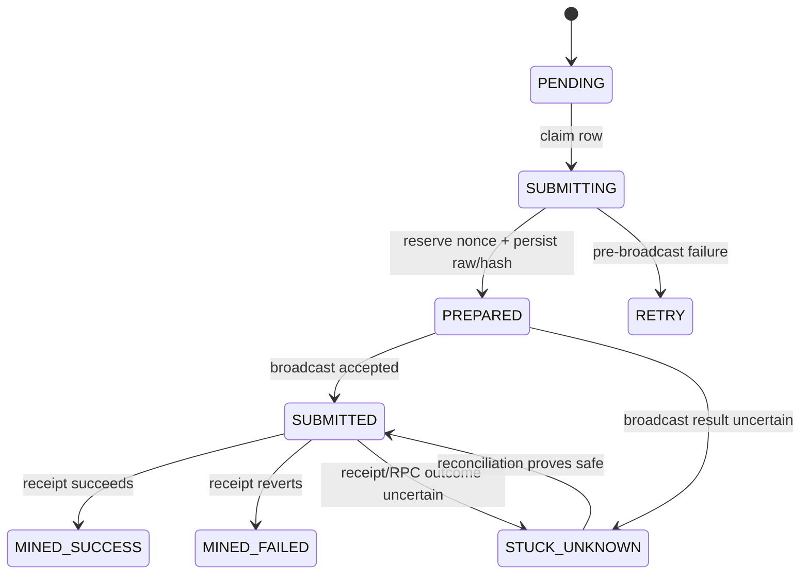
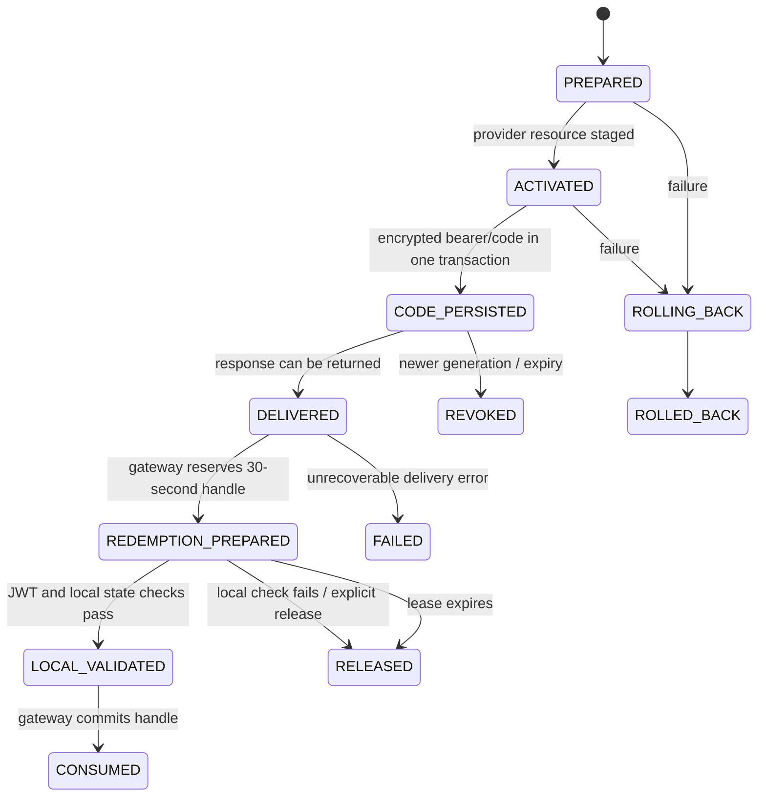
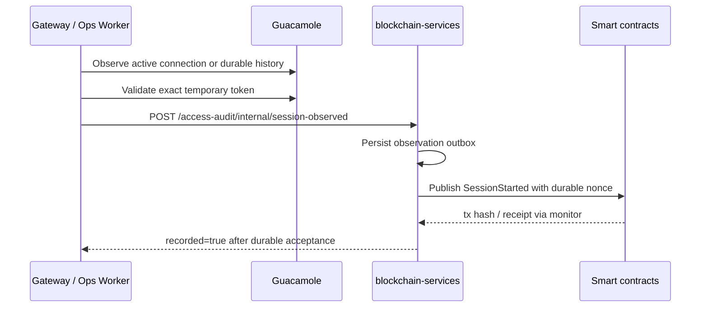
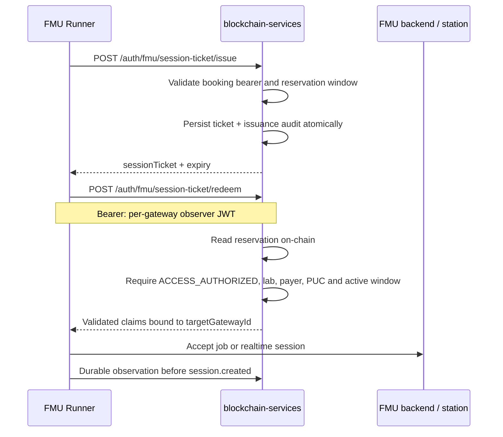
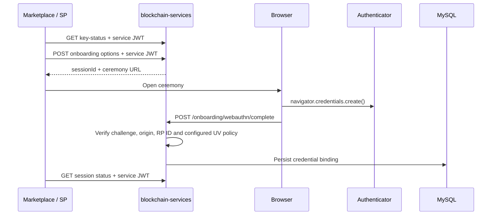

# Authentication, access delivery and session evidence

This guide describes the authentication boundary owned by
`blockchain-services` and the evidence boundary shared with Lab Gateway and
Ops Worker.

## Runtime boundary

`BLOCKCHAIN_SERVICES_MODE=provider-consumer` selects provider+consumer
operation. `consumer-only` is the repository default for a standalone consumer
deployment. `FEATURES_PROVIDERS_ENABLED` is retained only as a fallback when
the explicit mode is absent. The feature condition applies to the OIDC/JWKS
and FMU controller classes. Spring Security additionally denies the
provider-side SAML/access routes in `consumer-only`, even when a shared
controller mapping is present. Institutional check-in and status remain
available to the consumer role. Gateway/network isolation remains useful as
defense in depth, but is no longer the sole boundary for these routes.

| Endpoint | Purpose | Primary proof |
| --- | --- | --- |
| `GET /auth/jwks` | Provider signing key set (conditional) | Public read; provider controller enabled |
| `POST /auth/authorize-and-issue` | Provider-side combined check-in and access delivery (`provider-consumer` only) | Marketplace JWT + SAML + on-chain state |
| `POST /auth/access-credential` | Provider-side access credential flow (`provider-consumer` only) | Provider request + booking checks |
| `POST /auth/checkin-institutional` | Institutional wallet check-in | Institutional request and configured delegation policy |
| `POST /auth/checkin-institutional/status` | Query a delegated consumer check-in | Marketplace JWT + reservation binding |
| `POST /auth/access-code/redeem` | Prepare a browser/gateway redemption and return a short-lived handle (`provider-consumer` only) | Gateway ID + per-gateway redeemer credential |
| `POST /auth/access-code/redeem/commit` | Commit a prepared redemption after gateway-local validation (`provider-consumer` only) | Same gateway credential + redemption handle |
| `POST /auth/access-code/redeem/release` | Release a prepared redemption after local validation fails (`provider-consumer` only) | Same gateway credential + redemption handle |
| `POST /auth/fmu/session-ticket/issue` | Issue short-lived FMU handoff credential (conditional) | Booking bearer and reservation window |
| `POST /auth/fmu/session-ticket/redeem` | Exchange FMU ticket for claims (conditional) | Per-gateway session-observer JWT |
| `POST /access-audit/internal/session-observed` | Receive durable runtime observation | Per-gateway session-observer JWT |

The backend never treats a request arriving at OpenResty as proof that a lab
session was actually accepted or used.

The controller maps OIDC discovery at `/.well-known/openid-configuration`, but
the current Spring Security allow-list uses `/auth/.well-known/*`. Do not
integrate against discovery until those two mappings are aligned; `/auth/jwks`
is the supported key endpoint when provider mode is enabled.

## Browser access flow

The signed lab-access JWT remains server-side. Marketplace receives an opaque
`accessCode`; OpenResty prepares its redemption by POST, validates the JWT and
local destination/state, then commits the handle before setting the secure JTI
cookie and redirecting to a clean URL.

```mermaid
sequenceDiagram
    participant M as Marketplace
    participant B as blockchain-services
    participant C as Smart contracts
    participant G as Lab Gateway
    participant Q as Guacamole / FMU

    M->>B: POST /auth/authorize-and-issue
    B->>B: Verify Marketplace JWT
    B->>B: Verify SAML assertion and identity binding
    B->>C: Check reservation, payer and time window
    B->>B: Queue institutional check-in (durable outbox)
    B-->>M: 202/503 pending + Retry-After (fast response)
    M->>B: Retry credential issuance
    B->>C: Read ACCESS_AUTHORIZED
    B->>Q: Provision/activate only after authorization
    B->>B: Persist encrypted credential + opaque access code
    B-->>M: accessCode + labURL + reservationKey
    M->>G: Access request with opaque code
    G->>B: POST /auth/access-code/redeem
    B-->>G: Claims + redemptionHandle (30-second lease)
    G->>G: Verify JWT, destination, issuer, audience and local state
    G->>B: POST /auth/access-code/redeem/commit
    B-->>G: 204 consumed; or /release on local rejection
    G->>Q: Provision or open the runtime session
    Q-->>G: Connection / simulation response
```

### Validation order

The exact validator varies by endpoint, but booking-aware provider flows must
establish all of the following before issuing access material:

1. Marketplace JWT signature, issuer, audience and expiry.
2. SAML signature, issuer trust and required attributes.
3. Identity equality between the Marketplace token and SAML assertion.
4. Payer institution and wallet authorization.
5. Reservation identity, lab identity and validity window.
6. On-chain authorization (`ACCESS_AUTHORIZED`) when the flow requires it.

`payerInstitutionWallet` identifies the payer institution; it is not silently
substituted with the lab provider wallet.

## Authorization and check-in

The authorization endpoints do not poll the chain inside the HTTP request and
do not provision a Guacamole user while check-in is still pending. The
consumer-side check-in is persisted to a durable outbox; its submission and
receipt monitors run independently. A provider request that observes a
non-terminal, non-authorized reservation returns quickly as retryable:

```http
503 Service Unavailable
Retry-After: 1
```

```json
{
  "error": "ACCESS_AUTHORIZATION_PENDING",
  "retryable": true,
  "reservationKey": "0x...",
  "txHash": "0x..."
}
```

The caller retries `/auth/authorize-and-issue` or `/auth/access-credential`
after `Retry-After` (or its own backoff). Each retry performs one bounded chain
read. Once `ACCESS_AUTHORIZED` is visible, the provider acquires its fenced
provisioning lease, performs the bounded Guacamole/FMU activation, and persists
the encrypted credential and opaque access code. If the authorization
transaction is mined and reverted, the endpoint returns
`409 ACCESS_AUTHORIZATION_REJECTED`; no signed access JWT is issued before the
authorization gate succeeds. The final Guacamole/FMU activation remains a
bounded synchronous step so the returned code always references a live
resource; it is no longer coupled to transaction-mining latency.

For external reservation creation, the contract allows a five-minute pending
decision window and requires ten minutes of lead before `reservation.start`.
The provider listener uses 12-confirmation canonicality plus short polling and
retry delays; if that deadline passes, it leaves the request pending for expiry
and never confirms or captures it late.

When provider and consumer are separate backends, the provider can delegate the
institutional check-in to the payer institution's registered backend. When they
are the same backend, the request is persisted to the local check-in outbox and
the scheduled worker is the recovery path.

### Check-in transaction lifecycle


```mermaid
stateDiagram-v2
    [*] --> PENDING
    PENDING --> SUBMITTING: claim row
    SUBMITTING --> PREPARED: reserve nonce + persist raw/hash
    PREPARED --> SUBMITTED: broadcast accepted
    SUBMITTED --> MINED_SUCCESS: receipt succeeds
    SUBMITTED --> MINED_FAILED: receipt reverts
    SUBMITTING --> RETRY: pre-broadcast failure
    PREPARED --> STUCK_UNKNOWN: broadcast result uncertain
    SUBMITTED --> STUCK_UNKNOWN: receipt/RPC outcome uncertain
    STUCK_UNKNOWN --> SUBMITTED: reconciliation proves safe
```

Important invariants:

- Nonces are durable and scoped by `(chain_id, wallet_address)`.
- The signed raw transaction and locally computed hash are persisted before the
  first `eth_sendRawTransaction` call.
- A stale `SUBMITTING` row first looks up its stored hash and retransmits the
  stored bytes. It must not overwrite that evidence with a replacement first.
- `PRE_BROADCAST_BLOCKED` returns to `RETRY` without consuming an attempt;
  `PRE_BROADCAST_TRANSIENT` consumes the retry budget; and
  `PRE_BROADCAST_PERMANENT` becomes `MANUAL_INTERVENTION`. Only
  `BROADCAST_OUTCOME_UNKNOWN` becomes `STUCK_UNKNOWN`.
- Blocked pre-broadcast publication never releases
  `onchain_reservation_guard`; wallet contention therefore cannot strand a
  durable SessionStarted attestation. A mined revert becomes `MINED_FAILED`.
  The health response exposes failed/manual rows and stale `RETRY` or
  `SUBMITTING` rows as degraded queue blockers.
- Check-in, `SessionStarted` and generic institutional producers share nonce
  ownership but keep their own durable outbox records and monitors.

Ethereum nonce ordering can still create head-of-line blocking. The monitor
uses bounded same-nonce replacements and never skips a nonce merely because the
RPC call that reserved it failed.

## Access-code delivery lifecycle


```mermaid
stateDiagram-v2
    [*] --> PREPARED
    PREPARED --> ACTIVATED: provider resource staged
    ACTIVATED --> CODE_PERSISTED: encrypted bearer/code in one transaction
    CODE_PERSISTED --> DELIVERED: response can be returned
    DELIVERED --> REDEMPTION_PREPARED: gateway reserves 30-second handle
    REDEMPTION_PREPARED --> LOCAL_VALIDATED: JWT and local state checks pass
    LOCAL_VALIDATED --> CONSUMED: gateway commits handle
    REDEMPTION_PREPARED --> RELEASED: local check fails / explicit release
    REDEMPTION_PREPARED --> RELEASED: lease expires
    PREPARED --> ROLLING_BACK: failure
    ACTIVATED --> ROLLING_BACK: failure
    ROLLING_BACK --> ROLLED_BACK
    CODE_PERSISTED --> REVOKED: newer generation / expiry
    DELIVERED --> FAILED: unrecoverable delivery error
```

The code expiry is the earlier of the requested code TTL and the underlying
credential expiry. A retry after a lost response reuses the current unconsumed
generation; it does not create another Guacamole user or bearer. A pending
redemption lease is released explicitly or by expiry; only commit clears the
encrypted bearer and code material.

OpenResty uses `ACCESS_CODE_REDEEMER_CREDENTIALS_JSON` and `X-Gateway-ID` for
the code redemption route. `X-Gateway-ID` is the canonical lower-case public
host plus a non-default HTTPS port (for example, `lab.example:8443`); the
target gateway is then read from signed claims. An arbitrary caller-supplied
gateway ID cannot retarget a code.

## Guacamole and `SessionStarted`

OpenResty access acceptance is not `SessionStarted`. Ops Worker correlates the
token's temporary Guacamole user with both:

- the point-in-time `activeConnections` API; and
- `guacamole_connection_history`, when available, to cover a connection that
  opened and closed between two polls.

The exact token is validated against Guacamole before an observation is queued.
The backend only considers the observation durable when
`POST /access-audit/internal/session-observed` has committed the audit and the
signed attestation. The worker retries with backoff and marks delivery complete
only when the response says `recorded=true`.


```mermaid
sequenceDiagram
    participant G as Gateway / Ops Worker
    participant Q as Guacamole
    participant B as blockchain-services
    participant C as Smart contracts

    G->>Q: Observe active connection or durable history
    G->>Q: Validate exact temporary token
    G->>B: POST /access-audit/internal/session-observed
    B->>B: Persist observation outbox
    B->>C: Publish SessionStarted with durable nonce
    C-->>B: tx hash / receipt via monitor
    B-->>G: recorded=true after durable acceptance
```

In Lite mode the observation URL targets Full. Full derives the authenticated
`gatewayId` from the observer JWT and grants only `ROLE_SESSION_OBSERVER`.
`ADMIN_ACCESS_TOKEN` is not a substitute for an observer credential on this
route.

## FMU session tickets

Tickets are short-lived, reservation-bound credentials that authorize an FMU
`session.create` handoff. The current implementation allows the credential to
be redeemed again while it remains valid, but each redemption is a new handoff;
the ticket is not an FMU runtime session and is not the reconnect handle. The
default lifetime is 120 seconds and it never exceeds the booking window. Claims
are encrypted at rest and the ticket lookup key is hashed.

After `session.created`, reconnect through the Gateway with `session.attach`,
using the returned `sessionId` and the original validated context. Station
retains the existing FMU state only during `FMU_ATTACH_GRACE_SECONDS`; a
reconnect must not call `session.create` or replay the ticket. If that grace
period expires, the client must start a new handoff and therefore a new FMU
session.


```mermaid
sequenceDiagram
    participant R as FMU Runner
    participant B as blockchain-services
    participant F as FMU backend / station

    R->>B: POST /auth/fmu/session-ticket/issue
    B->>B: Validate booking bearer and reservation window
    B->>B: Persist ticket + issuance audit atomically
    B-->>R: sessionTicket + expiry
    R->>B: POST /auth/fmu/session-ticket/redeem
    Note over R,B: Bearer: per-gateway observer JWT
    B->>B: Read reservation on-chain
    B->>B: Require ACCESS_AUTHORIZED, lab, payer, PUC and active window
    B-->>R: Validated claims bound to targetGatewayId
    R->>F: Accept job or realtime session
    R->>B: Durable observation before session.created
```

FMU ticket issue and redemption use an independent token bucket configured by
`rate.limit.fmu.session-ticket.requests.*`. Issue requests are partitioned by
the `targetGatewayId` claim of the validated booking bearer, so multiple
gateways sharing an IP do not share the issue burst. Requests without a valid
gateway claim fall back to an IP bucket. Ticket issuance still validates the
booking bearer and its FMU claims. Redemption fails closed when the chain read
is unavailable and removes the ticket when the reservation is no longer
authorized. `BookingCanceled` and `BookingCanceledByProvider` also eagerly
delete all persisted tickets for the reservation; those event handlers are an
optimization, not the security boundary.

## WebAuthn credential lifecycle

WebAuthn registration is an onboarding ceremony, not a generic registration
endpoint. There is no `POST /webauthn/register` route.


```mermaid
sequenceDiagram
    participant M as Marketplace / SP
    participant B as blockchain-services
    participant U as Browser
    participant A as Authenticator
    participant D as MySQL

    M->>B: GET key-status + service JWT
    M->>B: POST onboarding options + service JWT
    B-->>M: sessionId + ceremony URL
    M->>U: Open ceremony
    U->>A: navigator.credentials.create()
    U->>B: POST /onboarding/webauthn/complete
    B->>B: Verify challenge, origin, RP ID and configured UV policy
    B->>D: Persist credential binding
    M->>B: GET session status + service JWT
```

`key-status`, `options` and `status` require a Marketplace service JWT with
`onboarding:webauthn`; the browser `complete` call and ceremony URL are bound to
the short-lived onboarding session. Credential revocation is
`POST /webauthn/revoke` and requires a Marketplace JWT with `webauthn:manage`.
When the Marketplace token includes a PUC, it must match the PUC being revoked.

Marketplace service-token configuration is derived by default. The audience
uses `BASE_DOMAIN` or `PUBLIC_BASE_URL`, then `SERVER_NAME` plus
`HTTPS_PORT`; `AUTH_MARKETPLACE_ENDPOINTS_AUDIENCE` is only an explicit
override. Issuer and subject default to `marketplace`. The institution binding
uses `AUTH_MARKETPLACE_ENDPOINTS_INSTITUTION_ID` or `PROVIDER_ORGANIZATION`
when provided, otherwise it is loaded from the persisted
`config/provider.properties` provisioning record. Pairing writes that record
after successful registration.

Credential persistence requires MySQL by default
(`WEBAUTHN_CREDENTIALS_REQUIRE_DATABASE=true`). Memory-only operation is for
isolated development only. The RP accepts only `WEBAUTHN_ATTESTATION_CONVEYANCE=none`.
The default `WEBAUTHN_USER_VERIFICATION=preferred` requests user verification
when possible and accepts an assertion without UV; `required` is available when
the deployment must reject clients that do not return `UV=true`. Set the RP ID
and allowed origins deliberately; an origin mismatch fails the ceremony rather
than falling back to an arbitrary browser origin.

## SAML, discovery and keys

The SAML metadata pipeline is documented in
[SAML Auto-Discovery](../../security/SAML_AUTO_DISCOVERY.md). The development default is
`saml.idp.trust-mode=any`; production deployments should set `whitelist` and
populate `saml.trusted.idp`.

Key paths default to:

- `PRIVATE_KEY_PATH=/app/data/keys/private_key.pem`
- `PUBLIC_KEY_PATH=/app/data/keys/public_key.pem`

The exact environment template is `.env.example`; do not infer secret paths
from an old deployment guide.

## Error semantics

| Status | Meaning |
| --- | --- |
| `400` | Invalid or incomplete request |
| `401` | Invalid identity, signature, scope or bearer |
| `403` | Valid request but wrong gateway/role/route credential |
| `409` | On-chain authorization was explicitly rejected |
| `503` | Upstream or on-chain state is pending/unavailable; inspect `Retry-After` |
| `500` | Unexpected internal failure |

For durable queue incidents, inspect `/health`, queue-specific counters and the
outbox rows before manually retrying. Never delete a `STUCK_UNKNOWN` row merely
to make a new nonce available.
