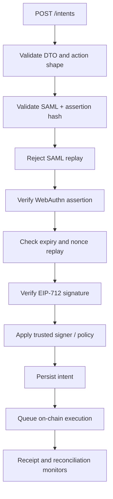
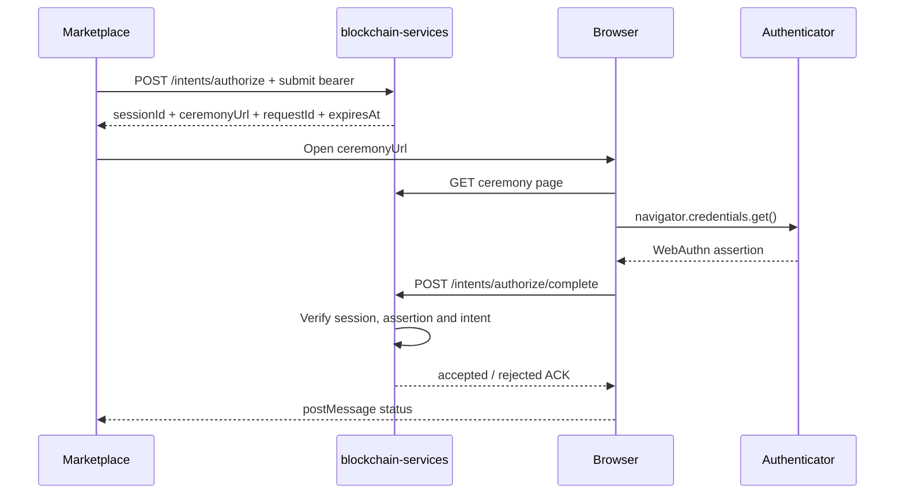
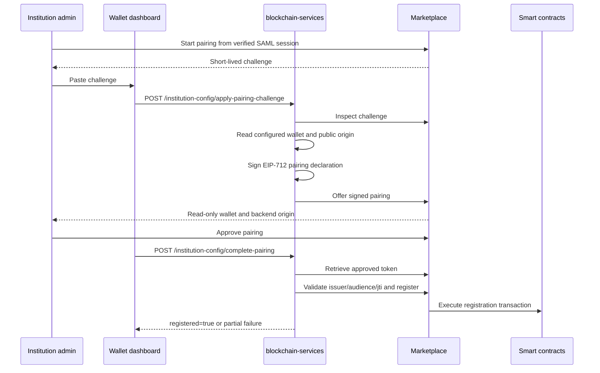

# Intents and institutional provisioning

This guide covers two independent surfaces:

1. intent submission and optional WebAuthn authorization under `/intents`;
2. provider/consumer registration under `/institution-config`.

The intent routes are publicly routable at the Spring Security layer but enforce
their own Marketplace JWT, scope and session checks. `/institution-config/**` is
also protected by `LocalhostOnlyFilter`. Keep those boundaries in place even
when a route is technically `permitAll` in the filter chain.

## Intent authorization

When `intents.auth.enabled=true` (default), the Marketplace bearer must be a
valid JWT with:

| Operation | Scope | Configuration |
| --- | --- | --- |
| Submit an intent | `intents:submit` | `intents.auth.submit-scope` |
| Start WebAuthn authorization | `intents:authorize` | `intents.auth.authorize-scope` |
| Notify registration mined | `intents:registration-mined` | `intents.auth.registration-mined-scope` |
| Read intent/session status | `intents:status` | `intents.auth.status-scope` |

The token must use issuer `marketplace`, subject `marketplace`, a unique `jti`,
the exact public origin of this backend as audience, the authenticated
`institutionId`, and a lifetime no longer than the configured short TTL.
Disable this check only for a deliberately isolated deployment; do not
compensate by exposing `/intents` publicly.

## Endpoint contract

| Method and path | Auth | Result |
| --- | --- | --- |
| `POST /intents` | Submit bearer | Validates and ACKs an intent for queueing |
| `GET /intents/{requestId}` | Status bearer | Returns execution status |
| `POST /intents/{requestId}/registration-mined` | Registration-mined bearer | Wakes queued processing after registration |
| `POST /intents/authorize` | Authorize bearer | Creates a WebAuthn authorization session |
| `GET /intents/authorize/status/{sessionId}` | Status bearer | Reads ceremony status |
| `GET /intents/authorize/ceremony/{sessionId}` | Session URL | Serves the browser ceremony HTML |
| `POST /intents/authorize/complete` | Session-bound body | Verifies the assertion and executes the intent |
| `POST /intents/authorize/client-error` | Diagnostic body | Records browser ceremony diagnostics |

The ceremony page and completion endpoint use the short-lived authorization
session as their context. Completion does not require a second Marketplace
bearer. Treat `sessionId` as a secret with the same care as a short-lived
authorization URL.

## Direct submission payload

`IntentSubmission` requires:

- `meta` (including action, request ID, nonce and expiry fields as applicable);
- one action payload variant (`actionPayload` or `reservationPayload`);
- EIP-712 `signature`;
- base64 SAML assertion;
- WebAuthn credential ID, client data, authenticator data and signature.

The service checks that the payload shape matches `meta.action`; do not send a
reservation payload for a non-reservation action.



The direct ACK means “accepted for processing”, not “mined”. The status
endpoint is the source for the later execution result. Typical states are
`queued`, `authorized_pending_registration`, `in_progress`, `executed`,
`failed` and `rejected`.

Only the material required to resume on-chain execution is durable: intent
metadata and the selected action/reservation payload. New payloads are wrapped
with AES-256-GCM using the required `INTENT_PAYLOAD_ENCRYPTION_KEY`; provide a
base64/base64url-encoded 32-byte key through the deployment secret store. The
SAML assertion, WebAuthn assertion material, client signature and typed data
are request-time verification inputs and are deliberately removed from the
persistence boundary. Flyway migration 41 redacts those fields from legacy JSON
rows. Terminal records also clear their execution payload. Do not depend on
intent storage as an archive of federated identity or authenticator evidence.

## WebAuthn authorization flow

Use this flow when the browser should perform the WebAuthn assertion rather than
embedding WebAuthn fields in a direct `POST /intents` payload.



`GET /intents/authorize/status/{sessionId}` is the fallback when the browser
callback is not delivered. `POST /intents/authorize/client-error` is diagnostic
only and does not authorize an intent.

## Provisioning surface

`/institution-config/**` is localhost/private-network restricted. Institutional
registration uses a Marketplace-generated pairing challenge. The browser may
enter only that challenge; wallet, backend origin, organization, network and
registry contract come from verified SSO claims, backend configuration, or the
Marketplace deployment configuration.

| Method and path | Mode | Purpose |
| --- | --- | --- |
| `GET /institution-config/status` | Both | Current config, registration and feature flags |
| `POST /institution-config/apply-pairing-challenge` | Both | Offer the backend's server-configured wallet and origin for a challenge |
| `POST /institution-config/complete-pairing` | Both | Retrieve the approved token and complete registration |
| `POST /institution-config/apply-provider-token` | Provider/direct-token onboarding | Apply an already issued signed provider token |
| `POST /institution-config/apply-consumer-token` | Consumer/direct-token onboarding | Apply an already issued signed consumer token |
| `POST /institution-config/save-and-register` | Retired | Rejects the old editable-form flow |
| `POST /institution-config/retry-registration` | Retired | Tokens are single-use; issue a new pairing |

Provider registration endpoints additionally require
`FEATURES_PROVIDERS_REGISTRATION_ENABLED=true`. Consumer token application does
not require provider mode.

The wallet dashboard welcome modal offers the direct-token path when the
institution has received a provisioning token from a DecentraLabs administrator.
Provider + consumer deployments submit it to `apply-provider-token`; consumer-only
deployments submit it to `apply-consumer-token`. If no direct token is available, the modal links to the backend pairing setup, which contains
the Marketplace challenge instructions.



Pairing validation includes challenge expiry, deployment identity, EIP-712
signature recovery and exact wallet matching. An approved provisioning token is
single-use: Marketplace atomically consumes the challenge and removes the raw
token after successful delivery. Final provisioning validation
includes signature, issuer, audience, replay (`jti`), role and URL/email sanity.
The old editable `save-and-register` surface is retired so form values cannot
select institutional identity. A `2xx` response with `registered=false` or
HTTP `206` means Marketplace registration still needs an explicit new pairing;
it is not proof of on-chain registration.

The token application body is:

```json
{ "token": "<provisioning_jwt>" }
```

Registration calls are made by `InstitutionRegistrationService` to the
Marketplace provider/consumer registration APIs. Keep the Marketplace base
URL and JWKS URL pinned to the deployment configuration; a token must not be
allowed to redirect registration to an arbitrary host.

## Configuration reference

Intent authorization:

- `INTENTS_AUTH_ENABLED`
- `INTENTS_AUTH_ISSUER`
- `INTENTS_AUTH_AUDIENCE`
- `INTENTS_AUTH_INSTITUTION_ID`
- `INTENTS_AUTH_SERVICE_SUBJECT`
- `INTENTS_AUTH_MAX_TTL_SECONDS`
- `INTENTS_AUTH_SUBMIT_SCOPE`
- `INTENTS_AUTH_AUTHORIZE_SCOPE`
- `INTENTS_AUTH_REGISTRATION_MINED_SCOPE`
- `INTENTS_AUTH_STATUS_SCOPE`
- `INTENTS_AUTH_CLOCK_SKEW_SECONDS`

`INTENTS_AUTH_AUDIENCE` and `INTENTS_AUTH_INSTITUTION_ID` are optional
overrides. When omitted, the audience is derived from the backend public-origin
configuration and the institution binding is read from the persisted
`provider.organization` provisioning record. The service subject and issuer
default to `marketplace`.
- `INTENT_TRUSTED_SIGNER`, `INTENT_DOMAIN_*`

Provisioning:

- `MARKETPLACE_BASE_URL`, `MARKETPLACE_PUBLIC_KEY_URL`
- `PUBLIC_BASE_URL`
- `FEATURES_PROVIDERS_ENABLED`
- `FEATURES_PROVIDERS_REGISTRATION_ENABLED`
- `PROVISIONING_PAIRING_TTL_SECONDS` (Marketplace-side pairing lifetime, capped at 15 minutes; approved-pairing Redis retention extends through token expiry)
- `PROVISIONING_TOKEN_HTTP_CONNECT_TIMEOUT_MS`
- `PROVISIONING_TOKEN_HTTP_READ_TIMEOUT_MS`

For network and token handling, see [Security Configuration](../../security/SECURITY.md).
