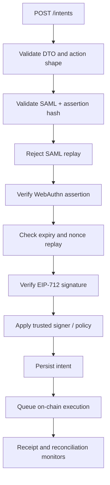
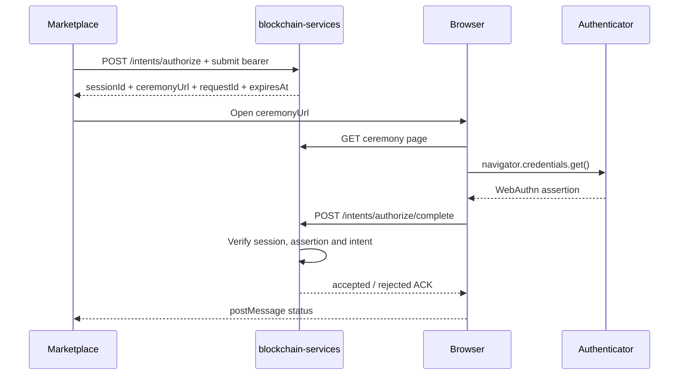
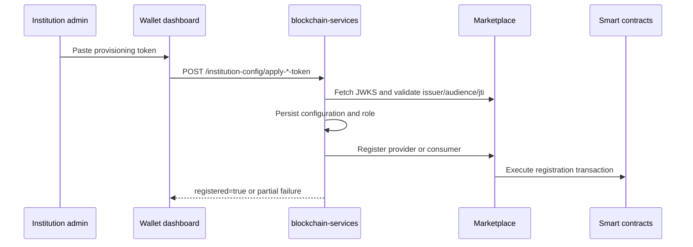

# Intents and institutional provisioning

This guide covers two independent surfaces:

1. intent submission and optional WebAuthn authorization under `/intents`;
2. provider/consumer registration under `/institution-config`.

Both surfaces are publicly routable at the Spring Security layer, but they
perform their own JWT, scope, localhost and token validation. Keep the network
boundary in place even when a route is technically `permitAll`.

## Intent authorization

When `intents.auth.enabled=true` (default), the Marketplace bearer must be a
valid JWT with:

| Operation | Scope | Configuration |
| --- | --- | --- |
| Submit, start authorization, notify registration | `intents:submit` | `intents.auth.submit-scope` |
| Read intent/session status | `intents:status` | `intents.auth.status-scope` |

The token must use issuer `marketplace`, audience `blockchain-services`, and the
configured clock-skew window. Disable this check only for a deliberately
isolated deployment; do not compensate by exposing `/intents` publicly.

## Endpoint contract

| Method and path | Auth | Result |
| --- | --- | --- |
| `POST /intents` | Submit bearer | Validates and ACKs an intent for queueing |
| `GET /intents/{requestId}` | Status bearer | Returns execution status |
| `POST /intents/{requestId}/registration-mined` | Submit bearer | Wakes queued processing after registration |
| `POST /intents/authorize` | Submit bearer | Creates a WebAuthn authorization session |
| `GET /intents/authorize/status/{sessionId}` | Status bearer | Reads ceremony status |
| `GET /intents/authorize/ceremony/{sessionId}` | Session URL | Serves the browser ceremony HTML |
| `POST /intents/authorize/complete` | Session-bound body | Verifies the assertion and executes the intent |
| `POST /intents/authorize/client-error` | Diagnostic body | Records browser ceremony diagnostics |

The ceremony page and completion endpoint use the short-lived authorization
session as their context. Completion does not require a second Marketplace
bearer. Treat `sessionId` as a secret with the same care as a short-lived
authorization URL.

## Direct submission payload

`IntentSubmission` requires:

- `meta` (including action, request ID, nonce and expiry fields as applicable);
- one action payload variant (`actionPayload` or `reservationPayload`);
- EIP-712 `signature`;
- base64 SAML assertion;
- WebAuthn credential ID, client data, authenticator data and signature.

The service checks that the payload shape matches `meta.action`; do not send a
reservation payload for a non-reservation action.



The direct ACK means “accepted for processing”, not “mined”. The status
endpoint is the source for the later execution result. Typical states are
`queued`, `in_progress`, `executed`, `failed` and `rejected`.

## WebAuthn authorization flow

Use this flow when the browser should perform the WebAuthn assertion rather than
embedding WebAuthn fields in a direct `POST /intents` payload.



`GET /intents/authorize/status/{sessionId}` is the fallback when the browser
callback is not delivered. `POST /intents/authorize/client-error` is diagnostic
only and does not authorize an intent.

## Provisioning surface

`/institution-config/**` is localhost/private-network restricted. It is used by
the wallet dashboard and setup tooling to apply a Marketplace-issued
provisioning token.

| Method and path | Mode | Purpose |
| --- | --- | --- |
| `GET /institution-config/status` | Both | Current config, registration and feature flags |
| `POST /institution-config/save-and-register` | Provider | Save editable config and register provider |
| `POST /institution-config/retry-registration` | Provider | Retry provider registration from saved config |
| `POST /institution-config/apply-provider-token` | Provider | Apply signed provider token and register |
| `POST /institution-config/apply-consumer-token` | Consumer | Apply signed consumer token and register |

Provider registration endpoints additionally require
`FEATURES_PROVIDERS_REGISTRATION_ENABLED=true`. Consumer token application does
not require provider mode.



Provisioning validation includes signature, issuer, audience, replay (`jti`),
role and URL/email sanity. A `2xx` response with `registered=false` or HTTP
`206` means configuration was saved but Marketplace registration still needs a
retry; it is not proof of on-chain registration.

The token application body is:

```json
{ "token": "<provisioning_jwt>" }
```

Registration calls are made by `InstitutionRegistrationService` to the
Marketplace provider/consumer registration APIs. Keep the Marketplace base
URL and JWKS URL pinned to the deployment configuration; a token must not be
allowed to redirect registration to an arbitrary host.

## Configuration reference

Intent authorization:

- `INTENTS_AUTH_ENABLED`
- `INTENTS_AUTH_ISSUER`
- `INTENTS_AUTH_AUDIENCE`
- `INTENTS_AUTH_SUBMIT_SCOPE`
- `INTENTS_AUTH_STATUS_SCOPE`
- `INTENTS_AUTH_CLOCK_SKEW_SECONDS`
- `INTENT_TRUSTED_SIGNER`, `INTENT_DOMAIN_*`

Provisioning:

- `MARKETPLACE_BASE_URL`, `MARKETPLACE_PUBLIC_KEY_URL`
- `PUBLIC_BASE_URL`
- `FEATURES_PROVIDERS_ENABLED`
- `FEATURES_PROVIDERS_REGISTRATION_ENABLED`
- `PROVISIONING_TOKEN_HTTP_CONNECT_TIMEOUT_MS`
- `PROVISIONING_TOKEN_HTTP_READ_TIMEOUT_MS`

For network and token handling, see [Security Configuration](../../security/SECURITY.md).
