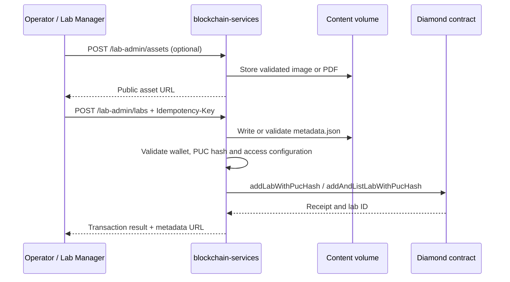
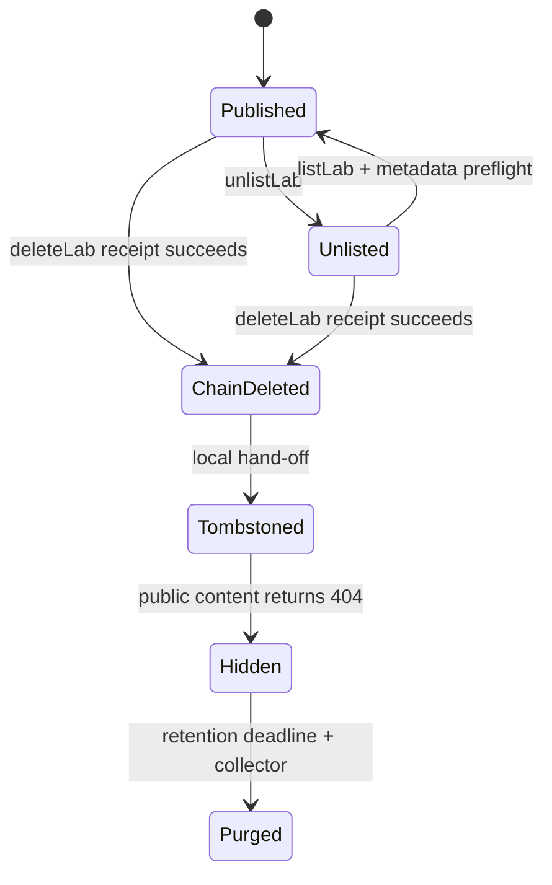

# Lab administration and content

This guide covers the provider-facing backend APIs for publishing labs,
managing their public metadata/content and issuing an FMU describe token. It is
not a Marketplace catalogue API.

## Access boundary

All `/lab-admin/**` routes pass through `LocalhostOnlyFilter`. By default, they
are loopback-only. A remote operations client needs the configured private
network policy plus either the normal admin access token or the dedicated
`X-Lab-Manager-Token` from an allowed `LAB_MANAGER_ALLOWED_CIDRS` range. The
lab-manager token never grants access outside `/lab-admin/**`.

`GET /lab-content/**` is intentionally different: it is a public, read-only
content route with `GET`, `HEAD` and `OPTIONS` CORS. Keep credentials, private
connection strings and internal runbooks out of the uploaded content tree.

## API overview

| Method and path | Purpose |
| --- | --- |
| `GET /lab-admin/status` | Provider wallet, configured creator PUC hash, content URLs, FMU inventory and Guacamole availability. |
| `GET /lab-admin/labs` | Labs owned by the institutional provider wallet. |
| `GET /lab-admin/guacamole/connections` | Safe Guacamole connection catalogue for administration. |
| `POST /lab-admin/assets` | Upload a JPEG/PNG/WebP/GIF image or PDF document. |
| `DELETE /lab-admin/assets` | Delete an uploaded image or document by its returned path. |
| `POST /lab-admin/labs` | Create a lab, optionally list it immediately. |
| `PUT /lab-admin/labs/{labId}` | Update a provider-owned lab. |
| `DELETE /lab-admin/labs/{labId}` | Delete a provider-owned lab and tombstone local content. |
| `POST /lab-admin/labs/{labId}/creator-binding` | Bind a non-zero `bytes32` creator PUC hash. |
| `POST /lab-admin/labs/{labId}/list` | List a lab after metadata preflight. |
| `POST /lab-admin/labs/{labId}/unlist` | Remove a lab from listing. |
| `POST /lab-admin/fmu/provider-describe-token` | Issue a 60-second FMU describe token for an `.fmu` filename. |

The full endpoint index, including non-lab routes, is in
[API reference](../../reference/API_REFERENCE.md).

## Publish and update flow

The provider wallet must be configured and registered on-chain. New labs also
require a non-zero `creatorPucHash`: send it in the request or configure
`PROVIDER_PUC_HASH`. A per-request value has precedence.



`LabAdminPublishRequest` contains `setupMode`, `listImmediately`,
`metadataUrl`, `metadata`, `price`, `accessURI`, `accessKey`,
`resourceType`, `allowDuplicate` and `creatorPucHash`.

- Use `setupMode: "quick"` with an HTTPS `metadataUrl` for externally hosted
  metadata.
- Use the default/full setup with a `metadata` object to generate
  `content/<contentId>/metadata.json` under `LAB_CONTENT_BASE_PATH`.
- Generated metadata must include `name` (maximum 160 characters) and
  `description` (maximum 4,000 characters). `image`, `images` and `docs`
  must be HTTPS or gateway content URLs.
- `price` is non-negative; `accessURI` and `accessKey` are required. Physical
  access configuration is validated against its resource type.
- Listing performs a metadata preflight. For gateway-hosted metadata, that
  means valid JSON, a file no larger than 1 MiB and the required fields.

Use a unique `Idempotency-Key` for every mutating request. Reusing the same key
with a different command returns `409 IDEMPOTENCY_KEY_PAYLOAD_MISMATCH`.
Publishing specifically requires an idempotency key; without one the request is
rejected. The service returns an existing owned lab for the same metadata URI
unless `allowDuplicate=true`.

An update that only changes the gateway-hosted metadata can return
`status: "offchain_updated"` without a chain transaction. All other on-chain
mutations return the transaction receipt status and hash; receipt success is
the completion criterion.

## Content lifecycle

Assets are stored below `content/<contentId>/images` or
`content/<contentId>/docs`. Files are limited to 10 MiB by service validation,
in addition to `LAB_CONTENT_MAX_FILE_SIZE` and
`LAB_CONTENT_MAX_REQUEST_SIZE` at the servlet layer. Uploads accept only the
listed content types and filenames are normalised before storage.

Deleting a lab first succeeds on-chain. The backend then writes a tombstone for
the matching local metadata/content directory. Tombstoned content returns 404
immediately, but remains on disk for `LAB_CONTENT_RETENTION` (default `7d`) so
operators can recover it. The scheduled collector removes expired tombstones
and their content every `LAB_CONTENT_GC_INTERVAL_MS` (default one hour).



If the chain deletion succeeds but writing the tombstone fails, the chain is
still authoritative. Restore write access and create/reconcile the tombstone;
do not recreate the lab merely to repair the local hand-off.

## FMU describe token

For provider-side metadata discovery, send:

```json
{ "fmuFileName": "Example.fmu" }
```

The response contains a signed `token` and `expiresIn: 60`. The filename must
end in `.fmu`. The dedicated provider endpoint
`/auth/fmu/provider-describe-token` instead validates a Marketplace bearer;
the lab-admin endpoint is protected by the administration boundary above.

## Operational checks

Before publishing, confirm:

- `GET /lab-admin/status` reports a configured wallet and `isProvider: true`;
- the creator PUC hash is configured or supplied in the request;
- content storage is persistent and writable;
- public URLs resolve from the gateway, not just the container;
- metadata contains no secrets and access configuration points at the intended
  Guacamole or FMU resource.

The generic lab metadata example remains available in
[example-lab-metadata.md](../../reference/example-lab-metadata.md).

