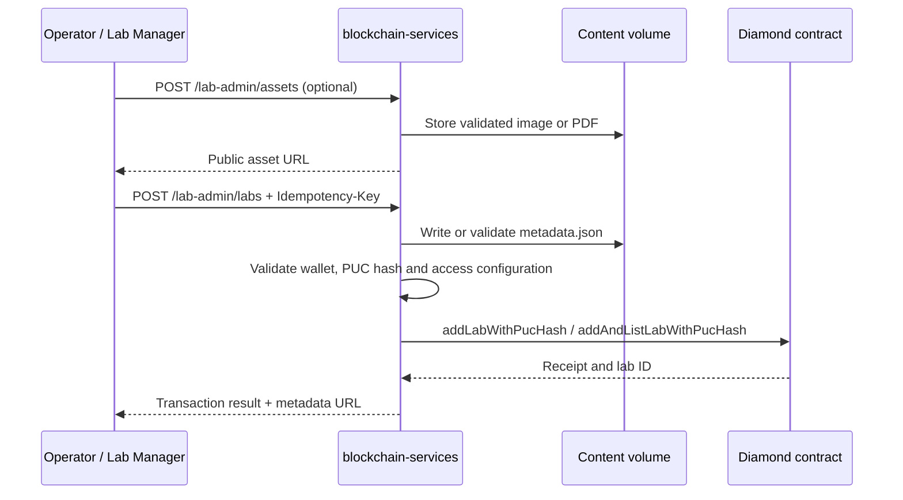
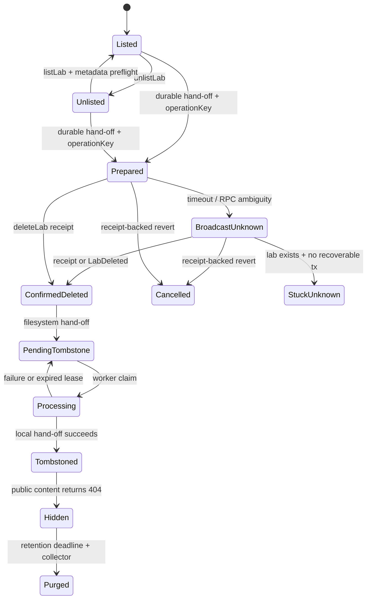

# Lab administration and content

This guide covers the provider-facing backend APIs for publishing labs,
managing their public metadata/content and issuing an FMU describe token. It is
not a Marketplace catalogue API.

The complete `/lab-admin/**` surface exists only in
`BLOCKCHAIN_SERVICES_MODE=provider-consumer`. In `consumer-only` the
controller is not created and Spring Security rejects every `/lab-admin/**`
request, including asset staging and preflight requests, even when the
institution's wallet is also a provider on-chain. The public
`/lab-content/**` read route is the common content surface and is not an
administrative write path.

## Access boundary

All `/lab-admin/**` routes pass through `LocalhostOnlyFilter`. By default, they
are loopback-only. A remote operations client needs the configured private
network policy plus either the normal admin access token or the dedicated
`X-Lab-Manager-Token` from an allowed `LAB_MANAGER_ALLOWED_CIDRS` range. The
lab-manager token never grants access outside `/lab-admin/**`.

`GET /lab-content/**` is intentionally different: it is a public, read-only
content route with `GET`, `HEAD` and `OPTIONS` CORS. Keep credentials, private
connection strings and internal runbooks out of the uploaded content tree.

## API overview

| Method and path | Purpose |
| --- | --- |
| `GET /lab-admin/status` | Provider wallet, configured creator PUC hash, content URLs, FMU inventory and Guacamole availability. |
| `GET /lab-admin/labs` | Labs owned by the institutional provider wallet. |
| `GET /lab-admin/reservations/upcoming` (`offset`, `limit`) | Upcoming pending, confirmed or access-authorized reservations for provider-owned labs. |
| `GET /lab-admin/reservations/actionable` (`offset`, `limit`, `cursor`) | Provider-cancellable reservations, including post-start service-failure cases still inside attestation grace. |
| `POST /lab-admin/reservations/{reservationKey}/cancel` | Deny a pending request or cancel a confirmed/access-authorized booking when its selected provider reason is eligible. |
| `GET /lab-admin/guacamole/connections` | Safe Guacamole connection catalogue for administration. |
| `POST /lab-admin/assets` | Upload a JPEG/PNG/WebP/GIF image or PDF document. |
| `DELETE /lab-admin/assets` | Delete an uploaded image or document by its returned path. |
| `POST /lab-admin/labs` | Create a lab, optionally list it immediately. |
| `PUT /lab-admin/labs/{labId}` | Update a provider-owned lab. |
| `DELETE /lab-admin/labs/{labId}` | Delete a provider-owned lab and tombstone local content. |
| `POST /lab-admin/labs/{labId}/list` | List a lab after metadata preflight. |
| `POST /lab-admin/labs/{labId}/unlist` | Remove a lab from listing. |
| `POST /lab-admin/fmu/provider-describe-token` | Issue a 60-second FMU describe token for an `.fmu` filename. |

The full endpoint index, including non-lab routes, is in
[API reference](../../reference/API_REFERENCE.md).

## Publish and update flow

The provider wallet must be configured and registered on-chain. New labs also
require a non-zero `creatorPucHash`: send it in the request or configure
`PROVIDER_PUC_HASH`. A per-request value has precedence.


```mermaid
sequenceDiagram
    participant O as Operator / Lab Manager
    participant B as blockchain-services
    participant S as Content volume
    participant C as Diamond contract

    O->>B: POST /lab-admin/assets (optional)
    B->>S: Store validated image or PDF
    B-->>O: Public asset URL
    O->>B: POST /lab-admin/labs + Idempotency-Key
    B->>S: Write or validate metadata.json
    B->>B: Validate wallet, PUC hash and access configuration
    B->>C: addLabWithPucHash / addAndListLabWithPucHash
    C-->>B: Receipt and lab ID
    B-->>O: Transaction result + metadata URL
```

`LabAdminPublishRequest` contains `setupMode`, `listImmediately`,
`metadataUrl`, `metadata`, `price`, `accessURI`, `accessKey`,
`resourceType`, `allowDuplicate` and `creatorPucHash`.

- Use `setupMode: "quick"` with an HTTPS `metadataUrl` for externally hosted
  metadata. Its origin must be one of the provider backend origins registered
  on-chain for the provider wallet; arbitrary HTTPS URLs and `ipfs://` are
  rejected by the backend preflight.
- Use the default/full setup with a `metadata` object to generate
  `content/<contentId>/metadata.json` under `LAB_CONTENT_BASE_PATH`.
- Generated metadata must include `name` (maximum 160 characters) and
  `description` (maximum 4,000 characters). `image`, `images` and `docs`
  must be HTTPS or gateway content URLs.
- The publisher normalizes root `images`/`docs` and the
  `attributes.additionalImages`/`attributes.docs` aliases before writing the
  file: images are merged and deduplicated with the first item as `image`,
  documentation is merged into the `docs` attribute, and root aliases are
  removed. A root `periodRules` value is copied to its attribute only when the
  attribute is not already present. See the [metadata example](../../reference/example-lab-metadata.md)
  for the exact precedence rules.
- For on-chain `resourceType == 1` (FMU), the off-chain metadata must declare
  `maxConcurrentUsers` as a positive integer. The backend validates it during
  publication, update, listing preflight and provider confirmation; the
  contract stores only `resourceType`.
- `price` is non-negative; `accessURI` and `accessKey` are required. Physical
  access configuration is validated against its resource type.
- Listing performs a metadata preflight. For gateway-hosted metadata, that
  means valid JSON, a file no larger than 1 MiB and the required fields.
  For remote metadata, the preflight uses the same HTTPS-only, exact-origin,
  DNS-pinned client as reservation processing, with bounded body/JSON size,
  content type, redirects, timeouts and concurrency.

Use a unique `Idempotency-Key` for every mutating request. Reusing the same key
with a different command returns `409 IDEMPOTENCY_KEY_PAYLOAD_MISMATCH`.
Publishing specifically requires an idempotency key; without one the request is
rejected. The service returns an existing owned lab for the same metadata URI
unless `allowDuplicate=true`.

## Upcoming reservations and provider cancellation

`GET /lab-admin/reservations/upcoming` reads the active reservation index for
each lab owned by the configured institutional provider wallet. It returns
reservations whose status is `PENDING`, `CONFIRMED` or `ACCESS_AUTHORIZED` and
whose start time has not passed. Prices are returned both as raw on-chain
units and as service credits; service credits use seven decimal places.

`GET /lab-admin/reservations/actionable` is the provider cancellation view. It
accepts optional `offset` (default `0`) and `limit` (default `100`, maximum
`500`) query parameters. The backend consumes the contract's bounded
`getReservationsOfTokenPaginated` pages and returns an opaque `nextCursor`
containing the next `(labId, offset)` position. The Lab Manager sends that
cursor on the next request; `nextOffset` remains the display/compatibility
offset. The response reports `pagination.hasMore` and the configured RPC
budget, but does not claim an exact actionable total because calculating one
would require scanning every reservation again.

Results are streamed in provider-lab/on-chain snapshot order and are not a
globally start-time-sorted list. The cursor is valid for the current snapshot;
on-chain reservation ordering is not guaranteed stable across mutations.
`LAB_ADMIN_RESERVATIONS_RPC_BUDGET` (default `500`) bounds the reservation
scan/enrichment RPC work per request. A budget exhaustion returns a cursor
rather than blocking the page.

The endpoint returns future pending/confirmed reservations and confirmed or
access-authorized reservations whose `SessionStarted` evidence is absent and
whose `end + 1 day` attestation deadline has not passed. Each reservation
contains `cancellationOptions`; the backend calculates every option's reason
code, deadline and expected reputation penalty from the same on-chain state
used by the cancellation transaction. Reason code `8` is omitted unless the
backend can verify the contract's service-failure conditions.

`POST /lab-admin/reservations/{reservationKey}/cancel` requires a unique
`Idempotency-Key` and a JSON body with a `reasonCode` from `1` to `255`:

```json
{ "reasonCode": 7 }
```

For `PENDING` reservations the provider reasons accepted by the contract are
`1` (manual), `2` (not eligible), `6` (technical failure) and `7` (provider
unavailable). For `CONFIRMED` reservations the endpoint calls
`cancelConfirmedBookingByProvider`; the contract requires the provider to own
the lab and refunds the full reservation price as service credits. Ordinary
provider cancellation is limited to the pre-start window and scores the lab
-1 with at least 24 hours' notice or -2 with less than 24 hours' notice. Reason
code `8` (`PROVIDER_SERVICE_FAILURE`) is the explicit no-service path: it may
also cancel an `ACCESS_AUTHORIZED` or already-started reservation while the
one-day `SessionStarted` attestation grace remains open, provided no
`SessionStarted` evidence exists; it scores -3. `PENDING` technical denials do
not incur this cancellation penalty. The contract re-checks ownership, state
and the attestation condition at transaction time, so a race with a consumer
or another operator fails safely rather than cancelling a changed booking.

At contract level, denial and provider cancellation are authorized for the
current lab owner or the backend currently authorized by that owner. This
lab-admin endpoint signs with the configured provider wallet and therefore uses
the owner path; the event-driven provider worker uses the delegated-backend
path when that wallet is the active on-chain backend. A payer institution or
unrelated backend cannot deny an external request.

An update that only changes the gateway-hosted metadata can return
`status: "offchain_updated"` without a chain transaction. All other on-chain
mutations return the transaction receipt status and hash; receipt success is
the completion criterion.

## Content lifecycle

Assets are stored below `content/<contentId>/images` or
`content/<contentId>/docs`. Files are limited to 10 MiB by service validation,
in addition to `LAB_CONTENT_MAX_FILE_SIZE` and
`LAB_CONTENT_MAX_REQUEST_SIZE` at the servlet layer. Uploads accept only the
listed content types and filenames are normalised before storage.

Deleting a lab first reserves a durable MySQL deletion hand-off, including the
exact `operationKey` passed to `InstitutionalTxManagerProvider`, and then submits
the on-chain transaction. The row stores the lab ID, metadata URI, transaction
hash, broadcast state, local hand-off state, retry count and last error. The
broadcast state is `PREPARED`, `BROADCAST_UNKNOWN`, `CONFIRMED_DELETED`,
`CANCELLED` or `STUCK_UNKNOWN`. A timeout or RPC failure moves the row to
`BROADCAST_UNKNOWN`; it is never cancelled without a receipt-backed revert.
The reconciler joins the row to the institutional transaction outbox, checks
receipts (including replacement hashes), and reads on-chain lab presence. A
mined successful deletion or a canonical `LabDeleted` event moves the row to
`CONFIRMED_DELETED`; a lab that still exists without a recoverable transaction
becomes `STUCK_UNKNOWN` and remains blocked for operator intervention.

Only `CONFIRMED_DELETED` rows are consumed by the filesystem worker, so a
prepared row with a null hash has an explicit reconciliation route and cannot
silently age forever. Content is denied while the row is pending, even before
the filesystem tombstone exists. If a worker crashes after claiming a row, its
expired `PROCESSING` lease is reclaimed by a later worker cycle. Tombstoned
content returns 404 immediately, but remains on disk for
`LAB_CONTENT_RETENTION` (default `7d`) so operators can recover it. The
scheduled collector removes expired tombstones and their content every
`LAB_CONTENT_GC_INTERVAL_MS` (default one hour), recording the `PURGED` state.


```mermaid
stateDiagram-v2
    [*] --> Listed
    Listed --> Unlisted: unlistLab
    Unlisted --> Listed: listLab + metadata preflight
    Listed --> Prepared: durable hand-off + operationKey
    Unlisted --> Prepared: durable hand-off + operationKey
    Prepared --> BroadcastUnknown: timeout / RPC ambiguity
    BroadcastUnknown --> ConfirmedDeleted: receipt or LabDeleted
    BroadcastUnknown --> Cancelled: receipt-backed revert
    BroadcastUnknown --> StuckUnknown: lab exists + no recoverable tx
    Prepared --> ConfirmedDeleted: deleteLab receipt
    Prepared --> Cancelled: receipt-backed revert
    ConfirmedDeleted --> PendingTombstone: filesystem hand-off
    PendingTombstone --> Processing: worker claim
    Processing --> Tombstoned: local hand-off succeeds
    Processing --> PendingTombstone: failure or expired lease
    Tombstoned --> Hidden: public content returns 404
    Hidden --> Purged: retention deadline + collector
```

`Listed`, `Unlisted` and `Deleted` are on-chain lab states. `PREPARED`,
`BROADCAST_UNKNOWN`, `CONFIRMED_DELETED`, `CANCELLED` and `STUCK_UNKNOWN`
describe the broadcast decision; `PendingTombstone`, `PROCESSING`,
`Tombstoned` and `PURGED` describe only the local content hand-off. A
tombstone or purge never recreates or changes the on-chain lab.

If the chain deletion succeeds but writing the tombstone fails, content remains
blocked and the outbox worker retries it. The chain remains authoritative; do
not recreate the lab merely to repair the local hand-off.

## FMU describe token

For provider-side metadata discovery, send:

```json
{ "fmuFileName": "Example.fmu" }
```

The response contains a signed `token` and `expiresIn: 60`. The filename must
end in `.fmu`. The dedicated provider endpoint
`/auth/fmu/provider-describe-token` instead validates a Marketplace bearer;
the lab-admin endpoint is protected by the administration boundary above.

## Operational checks

Before publishing, confirm:

- `GET /lab-admin/status` reports a configured wallet and `isProvider: true`;
- the creator PUC hash is configured or supplied in the request;
- content storage is persistent and writable;
- public URLs resolve from the gateway, not just the container;
- metadata contains no secrets and access configuration points at the intended
  Guacamole or FMU resource.

The generic lab metadata example remains available in
[example-lab-metadata.md](../../reference/example-lab-metadata.md).
