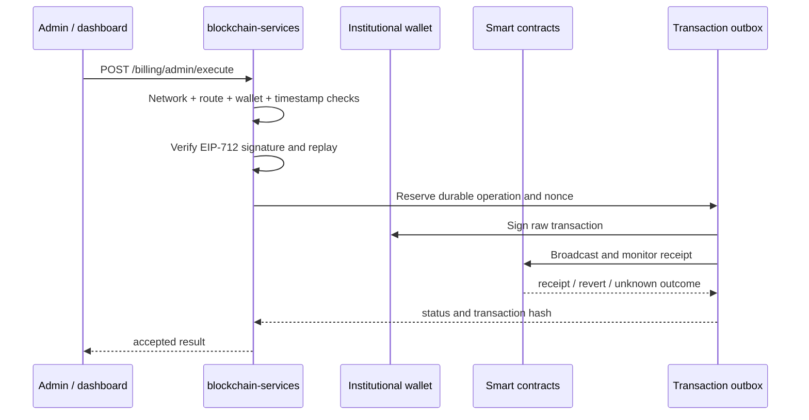
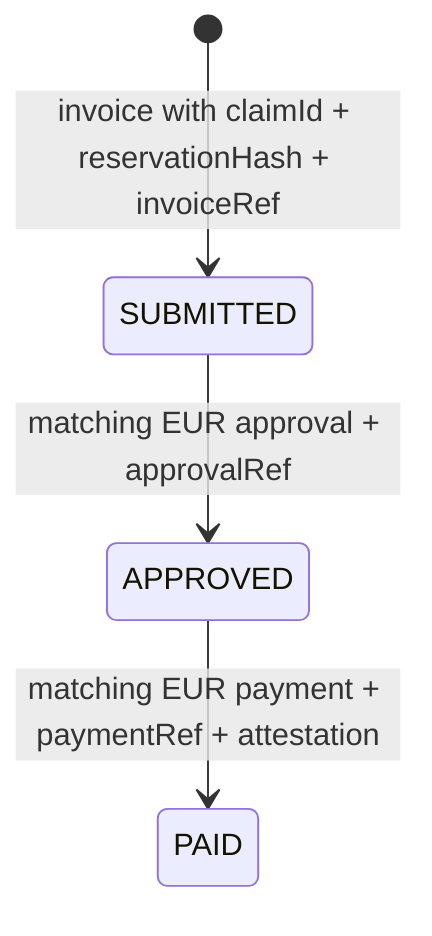

# Wallet, billing and administration

This guide covers the institutional wallet, service-credit funding and
provider-admin surfaces. These routes are operational APIs, not end-user
Marketplace APIs.

## Network and authentication boundary

`LocalhostOnlyFilter` protects `/wallet`, `/billing`, `/wallet-dashboard`,
`/institution-config`, `/lab-admin` and `/access-audit/internal`. Requests are
allowed from loopback by default. Remote private-network access requires the
matching `ADMIN_DASHBOARD_ALLOW_PRIVATE`, `SECURITY_ALLOW_PRIVATE_NETWORKS` and
CIDR settings, plus a valid route token when access-token enforcement applies.
Forwarded client addresses are considered only behind the configured trusted
proxies.

Billing admin routes additionally require `ROLE_INTERNAL` in provider mode. In
consumer-only mode the local/private-network filter is the boundary and a valid
`ADMIN_ACCESS_TOKEN` is the intended remote-administration control. The token
may be supplied through `X-Access-Token`, a Bearer header or the configured
cookie, not through a query parameter.

Never expose `/wallet/reveal` or mutating billing endpoints directly to the
Internet.

## Wallet API

| Method and path | Purpose |
| --- | --- |
| `GET /wallet/health` | Wallet subsystem health (network exception to localhost restriction) |
| `POST /wallet/create` | Create and persist an institutional wallet |
| `POST /wallet/import` | Import a private key or mnemonic and replace the active wallet |
| `POST /wallet/reveal` | Break-glass private-key reveal |
| `GET /wallet/{address}/balance` | Read native balance and network |
| `GET /wallet/{address}/transactions` | Read transaction history |
| `GET /wallet/listen-events` | Read contract event listener status |
| `GET /wallet/networks` | List configured networks |
| `POST /wallet/switch-network` | Switch active network |

Wallet private keys are encrypted at rest. The runtime persists the wallet data
under `WALLET_FILE_PATH`; the wallet-config encryption key is supplied by
`WALLET_CONFIG_ENCRYPTION_KEY` or persisted at `WALLET_CONFIG_KEY_FILE`.

The generic institutional transaction outbox is scoped on every monitor pass to
the RPC chain ID and institutional wallet address currently active in the
process. Rows from a previous network or rotated wallet remain durable but are
quarantined from signing, receipt lookup and nonce recovery; reconcile them
only after restoring the matching RPC and wallet configuration. This boundary
is required because `/wallet/switch-network` can change the active RPC while
the service is running.

## Billing and funding API

Funding-order and credit-account routes are available under `/billing`:

- `POST /billing/funding-orders`
- `GET /billing/funding-orders` and `GET /billing/funding-orders/{id}`
- `POST /billing/funding-orders/{id}/invoice`
- `POST /billing/funding-orders/{id}/confirm-payment`
- `POST /billing/funding-orders/{id}/cancel`
- `POST /billing/funding-orders/{id}/mark-credited`
- `GET /billing/credit-accounts/{address}`
- `GET /billing/credit-accounts/{address}/lots`
- `GET /billing/credit-accounts/{address}/movements`

The current billing model is based on internal service credits. They are not redeemable for cash or transferable as money. Eligible reservation
cancellations and service non-delivery may return the applicable credits to the institutional account according to the reservation lifecycle; funding, credit lots, expiry and movements are represented in the backend and reconciled with Smart-Contracts state.

## Administrative transaction API

### Signed admin execution

`POST /billing/admin/execute` validates the configured institutional wallet,
request timestamp, EIP-712 signature and replay state before dispatching one of
the supported operations:

- `AUTHORIZE_BACKEND`, `REVOKE_BACKEND`, `ADMIN_RESET_BACKEND`;
- `SET_USER_LIMIT`, `SET_SPENDING_PERIOD`, `RESET_SPENDING_PERIOD`;
- `ISSUE_SERVICE_CREDITS`, `ADJUST_SERVICE_CREDITS`;
- `TRANSITION_PROVIDER_RECEIVABLE_STATE`, `COLLECT_LAB_PAYOUT`.

The signed request includes the configured `adminWalletAddress`, operation,
operation-specific fields, a millisecond `timestamp` and the EIP-712
`signature`. For example:

```json
{
  "adminWalletAddress": "0x...",
  "operation": "SET_USER_LIMIT",
  "spendingLimit": "100",
  "timestamp": 1730000000000,
  "signature": "0x..."
}
```

The timestamp/replay window is five minutes by default. A valid signature only
authorizes dispatch; the receipt monitor remains the source of truth for mined
success or revert.



The response confirms dispatch or a known failure; it is not a substitute for
receipt reconciliation. For server-side provider payout use
`POST /billing/admin/request-provider-payout`; inspect a submitted operation
with `GET /billing/admin/transaction-status?txHash=...`.

The durable outbox key is derived from the signed command instance (timestamp
and signature), not from calldata alone. Retries within the same processing
context retain that key; a new signed timestamp is a new command and receives
its own nonce. The HTTP anti-replay check still rejects a duplicate request
received as a second external submission.
Lab-admin mutations accept an optional `Idempotency-Key` header for the same
purpose, as does the server-side provider-payout endpoint. Operators can tune
recovery of vanished generic submissions with
`INSTITUTIONAL_TRANSACTION_OUTBOX_SUBMITTED_STALE_AFTER_MS` (default two
minutes); a visible stale row becomes `REPLACEMENT_PENDING`, keeps its nonce
and payload, and receives a bounded same-nonce replacement. Every superseded
hash is retained in replacement history and is reconciled alongside the
current hash. The generic monitor always checks receipts and node visibility
before reading the pending nonce, including for `STUCK_UNKNOWN` rows. Retryable
replacements apply `INSTITUTIONAL_TRANSACTION_OUTBOX_MONITOR_GAS_BUMP_PERCENT`
(default 20%) from the original gas price. The max-attempts and max-pending
settings bound automatic recovery; an exhausted row remains
`STUCK_UNKNOWN` and is reported for manual intervention rather than being
retransmitted indefinitely.

### Read-only administration

- `GET /billing/admin/status`
- `GET /billing/admin/balance`
- `GET /billing/admin/transactions`
- `GET /billing/admin/contract-info`
- `GET /billing/admin/billing-info`
- `GET /billing/admin/provider-labs`
- `GET /billing/admin/provider-receivable-status`
- `GET /billing/admin/top-spenders`
- `GET|POST /billing/admin/notifications`
- `POST /billing/admin/notifications/send`
- `POST /billing/admin/notifications/test`

### Provider settlement claims

Provider network and receivable operations are under `/billing/provider-network`
and `/billing/provider-receivables`. Provider settlement is a local, auditable
claim lifecycle rather than an implicit status switch:



An invoice requires a unique `claimId`, non-zero `reservationHash`, unique
`invoiceRef`, provider address and positive EUR amount. Approval is allowed
only from `SUBMITTED`; its EUR amount must exactly match the invoice and its
`approvalRef` must be unique. Payment is allowed only from `APPROVED`; its
provider and EUR amount must match the claim and it requires unique
`paymentRef` plus a non-empty `paymentAttestation`. `bankRef`, `eurcTxHash` and
`usdcTxHash` are optional supplementary evidence.

Use the controller DTOs or dashboard for JSON field names. A client must not
retry a new claim/payment reference after a lost response; first query the
existing invoice or reconcile the unique reference.

## Compliance exports

The actual export paths are:

- `GET /billing/compliance/mica-volume`
- `GET /billing/compliance/exports/prepaid-balances?address=0x...`
- `GET /billing/compliance/exports/consumed?address=0x...&limit=1000`
- `GET /billing/compliance/exports/expired?address=0x...`
- `GET /billing/compliance/exports/receivable-accruals`
- `GET /billing/compliance/exports/completed-payouts?providerAddress=0x...`
- `GET /billing/compliance/exports/provider-network`

The operational use of these exports is maintained in private compliance
runbooks.

## Dashboard and provisioning

- `/wallet-dashboard/` serves the wallet and billing UI.
- `/institution-config/` serves provider/consumer configuration UI.
- `/lab-admin/**` is a separate provider-lab surface; see
  [Lab administration and content](../lab-administration/LAB_ADMINISTRATION.md).
- Provisioning token flows are documented in
  [Intents and provisioning](../intents/INTENTS_PROVISIONING.md).

`/onboarding/token/**` is reserved by filters/CORS in this repository version;
there is no public controller endpoint for it.

## Configuration quick reference

| Area | Keys |
| --- | --- |
| Contract/RPC | `CONTRACT_ADDRESS`, `BLOCKCHAIN_NETWORK_ACTIVE`, `ETHEREUM_MAINNET_RPC_URL`, `ETHEREUM_SEPOLIA_RPC_URL` |
| Wallet persistence | `WALLET_PERSISTENCE_ENABLED`, `WALLET_FILE_PATH`, `WALLET_CONFIG_ENCRYPTION_KEY`, `WALLET_CONFIG_KEY_FILE` |
| Network boundary | `ADMIN_DASHBOARD_LOCAL_ONLY`, `ADMIN_DASHBOARD_ALLOW_PRIVATE`, `ADMIN_ALLOWED_CIDRS`, `SECURITY_ALLOW_PRIVATE_NETWORKS` |
| Admin token | `ADMIN_ACCESS_TOKEN`, `ADMIN_ACCESS_TOKEN_HEADER`, `ADMIN_ACCESS_TOKEN_COOKIE`, `ADMIN_ACCESS_TOKEN_REQUIRED` |
| Billing domain | `BILLING_ADMIN_DOMAIN_*`, `INTENT_DOMAIN_*` |

The root `.env.example` and `src/main/resources/application.properties` are the
authoritative configuration references.
